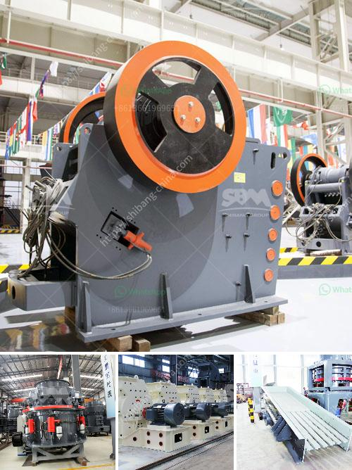

<h3>kaolin crusher plant machinery</h3>
Kaolin, a kind of non-metallic mineral resource, is widely used in many industrial sectors. In order to meet the requirements of paper, plastic, paint, and coating production, many kaolin industrial fields have shown increasingly high advanced requirements for the processing and crushing of kaolin materials.

To meet this growing demand, kaolin crusher plant machinery has been developed. Crushing is the first stage in the process of kaolin production. It is important to choose the right crusher for the kaolin material in order to ensure the efficient and stable operation of the whole kaolin processing plant.

The cone crusher is one of the most common ones and often used as the secondary crushing machine in the kaolin crushing line. By combining with the efficient and reliable impact crusher, this type of crusher can effectively reduce the size of the kaolin particles and further improve the processing efficiency.

Besides the cone crusher, there are also other types of kaolin crusher plants, such as hammer crusher, grinding mill, vibrating feeder, vibrating screen, and belt conveyor, etc. These equipment are all indispensable in kaolin processing and production, and should be chosen based on the specific requirements of the kaolin types.

When purchasing kaolin crusher plant machinery, it is important to check the quality of the equipment and the reputation of the manufacturer. A reliable and reputable manufacturer will provide high-quality machinery with advanced technology, durable parts, and comprehensive services, ensuring the smooth operation and long service life of the kaolin crusher plant.

In conclusion, the kaolin crusher plant machinery plays a crucial role in the kaolin processing and production. With the development of advanced technology and high-performance equipment, more and more customers are willing to invest in kaolin processing plants. So, if you are interested in this industry, it is wise to choose a reliable manufacturer and a suitable crusher plant to start your business.
<h3>Contact us</h3><ul><li><strong>Whatsapp:&nbsp;<a href="https://wa.me/8613661969651">+8613661969651</a></strong></li><li><a href="https://swt.shibang-china.com/?git&amp;zhl&amp;kaolin crusher plant machinery"><strong>Online Service(chat now)</strong></a></li></ul><h3>Related</h3><ul><li><a href='sayaji impact crusher specifications.md'>sayaji impact crusher specifications</a></li><li><a href='cost of barite crusher in nigeria.md'>cost of barite crusher in nigeria</a></li><li><a href='density of balls for mills.md'>density of balls for mills</a></li><li><a href='crushing mineral crushing meaning.md'>crushing mineral crushing meaning</a></li><li><a href='cost of an industrial mill.md'>cost of an industrial mill</a></li></ul>