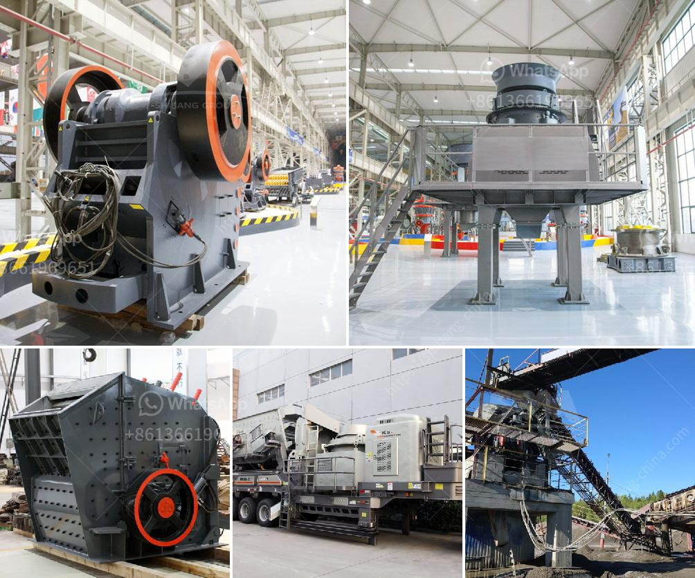

<h3>kaolin dry beneficiation</h3>
Kaolin is a mineral that is often found near various types of geological deposits. It is commonly used in various industries, including ceramics, paper, and paint. The beneficiation process of kaolin helps improve its quality and commercial value by removing unwanted substances.

Dry beneficiation of kaolin is an important process in the mining industry, as it reduces the water content in the ore and improves its quality. The process involves the removal of impurities like iron oxide, alumina, and silica, which can adversely affect the product's physical and chemical properties.

One of the main techniques used for dry beneficiation of kaolin is air classification. In this process, the kaolin ore is first crushed and then ground to achieve the desired particle size. The ground ore is then fed into an air classifier, which separates the fine particles from the coarse ones based on their size and density. The fine particles, which contain high-quality kaolin, are collected at the top of the classifier, while the coarse particles are discharged at the bottom.

Air classification is an effective method for dry beneficiation of kaolin because it provides a high degree of particle separation. It also offers the advantage of being a dry process, which eliminates the need for water and reduces environmental impact. Additionally, air classification can handle large volumes of ore and produce a high-quality kaolin product that meets market standards.

Another technique used for dry beneficiation of kaolin is magnetic separation. This process involves the use of magnetic separators to separate the magnetic impurities from the kaolin ore. Magnetic separation is particularly effective for removing iron oxide, which is a common impurity in kaolin. By removing the iron oxide, the quality of the kaolin is significantly improved, making it more suitable for various applications.

Dry beneficiation of kaolin has several advantages over wet beneficiation processes. Firstly, it eliminates the need for large amounts of water, which helps conserve this valuable resource. Secondly, it reduces the costs associated with water treatment and transportation. Lastly, it minimizes the environmental impact of the beneficiation process by eliminating the discharge of contaminated wastewater into rivers or water bodies.

In conclusion, dry beneficiation of kaolin is an important process that helps improve the quality and commercial value of this mineral. By removing impurities like iron oxide, alumina, and silica, the kaolin product becomes more suitable for various industries. Air classification and magnetic separation are two commonly used techniques for dry beneficiation. They offer several advantages over wet beneficiation processes, including water conservation, cost reduction, and environmental sustainability. Overall, dry beneficiation of kaolin plays a crucial role in the mining industry and helps meet the growing demand for high-quality kaolin products.
<h3>Contact us</h3><ul><li><strong>Whatsapp:&nbsp;<a href="https://wa.me/8613661969651">+8613661969651</a></strong></li><li><a href="https://swt.shibang-china.com/?git&amp;zhl&amp;kaolin dry beneficiation"><strong>Online Service(chat now)</strong></a></li></ul><h3>Related</h3><ul><li><a href='quarry machines for sale in kenya.md'>quarry machines for sale in kenya</a></li><li><a href='static jaw crusher for sale.md'>static jaw crusher for sale</a></li><li><a href='limestone crushers for chicken feed production.md'>limestone crushers for chicken feed production</a></li><li><a href='crankshaft of a jaw crusher.md'>crankshaft of a jaw crusher</a></li><li><a href='granite crusher south africa.md'>granite crusher south africa</a></li></ul>