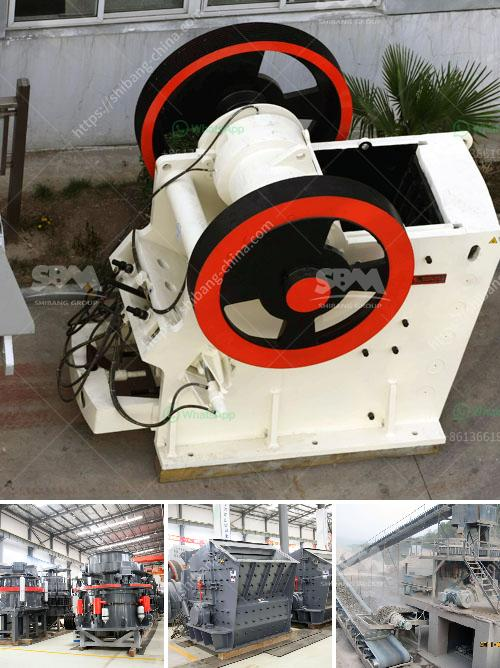

<h3>kaolin processing crusher uganda</h3>
Kaolin, also known as china clay, is a white, soft, plastic clay widely used in the manufacture of paper, ceramics, rubber, and paints. It is derived from the mineral kaolinite, which is a weathered form of the mineral feldspar. Kaolin is found in abundance in many parts of the world, including Uganda, where it is extracted and processed for various applications.

The kaolin processing industry in Uganda has been growing rapidly due to the increasing demand for the mineral both domestically and internationally. The country has rich deposits of kaolin, particularly in the western region of the country such as in the districts of Karamoja and Rakai.

The first step in the process of kaolin extraction is to explore and assess the mineral deposits in the area. This is done by conducting geological surveys and tests to determine the quality and quantity of kaolin present. Once a suitable deposit is identified, the extraction process begins.

The process of kaolin extraction involves mining, crushing, and grinding the kaolin-containing ore to a desired particle size and consistency. This process is usually carried out using jaw crushers, impact crushers, cone crushers, or gyratory crushers, depending on the specific characteristics of the kaolin.

After the ore has been crushed, it is further processed by grinding it into a fine powder. This is accomplished using various types of mills, such as ball mills, hammer mills, and vertical roller mills. The grinding process helps to separate impurities from the kaolin, such as quartz, mica, and other minerals.

Once the kaolin has been finely ground, it is then subjected to a series of beneficiation processes to remove impurities and improve its quality. These processes include air classification, froth flotation, magnetic separation, and chemical leaching.

The processed kaolin is then dried, typically using rotary dryers or flash dryers, to remove any remaining moisture. The dried kaolin is then ready for further processing or packaging, depending on its intended application.

The kaolin processing industry in Uganda has provided numerous economic benefits to the country, including the creation of employment opportunities and the generation of revenue through exports. Kaolin is primarily used in the manufacture of ceramics, where it serves as a binding agent and a filler, improving the strength and plasticity of the final product.

Additionally, kaolin is used in the production of paper, as it enhances the smoothness, brightness, and printability of the paper surface. It is also used in the manufacturing of rubber products, such as tires and hoses, to improve their strength and elasticity.

In conclusion, the kaolin processing industry in Uganda plays a vital role in the country's economy. The extraction and processing of kaolin provide employment opportunities and contribute to the export earnings of the nation. As the demand for kaolin continues to grow, it is important to ensure sustainable and responsible mining practices to minimize the environmental impact and maximize the economic benefits of this valuable mineral resource.
<h3>Contact us</h3><ul><li><strong>Whatsapp:&nbsp;<a href="https://wa.me/8613661969651">+8613661969651</a></strong></li><li><a href="https://swt.shibang-china.com/?git&amp;zhl&amp;kaolin processing crusher uganda"><strong>Online Service(chat now)</strong></a></li></ul><h3>Related</h3><ul><li><a href='coal mining vibrating screens.md'>coal mining vibrating screens</a></li><li><a href='raymond mill model.md'>raymond mill model</a></li><li><a href='used equipment ball mill sale.md'>used equipment ball mill sale</a></li><li><a href='vertical grinding machine black and dacker.md'>vertical grinding machine black and dacker</a></li><li><a href='cost of grinding machines.md'>cost of grinding machines</a></li></ul>