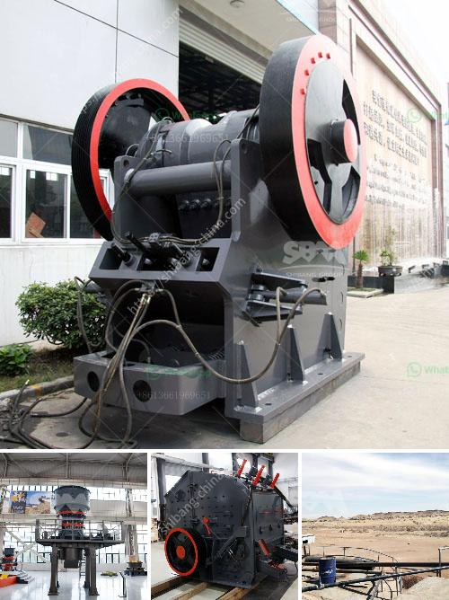

<h3>kenya eccentric jaw crushers price</h3>
Kenya, a country known for its breathtaking landscapes, rich wildlife, and vibrant culture, has also made a mark in the mining industry. One noteworthy equipment that has gained popularity over the years is the Kenya eccentric jaw crusher. This jaw crusher is unique due to its eccentricity, which provides excellent performance even in the most challenging conditions.

The eccentric jaw crusher is often used in primary crushing process. It is quite popular due to its versatility and price point. In addition, the eccentricity ensures the jaw crusher can handle rocks of varying hardness. This ability to handle different types of materials makes the jaw crusher perfect for various mining applications.

When it comes to price, the eccentric jaw crusher is not only affordable, but its value for money is unmatched. The price range of the eccentric jaw crusher is determined by factors such as the capacity, motor power, and the thickness of the materials being processed. With a range starting from as low as $8,000, the jaw crusher ensures a cost-effective solution for processing materials.

Another reason why the eccentric jaw crusher stands out is its high efficiency and productivity. The crushing chamber shaped like a V enables the material to be processed more efficiently, resulting in higher production rates. Therefore, mining companies in Kenya can benefit from improved productivity without compromising quality.

Moreover, the eccentric jaw crusher requires minimum maintenance and has a longer lifespan, reducing the need for costly replacements. This durability makes it an ideal investment for mining companies in Kenya, providing long-term value.

In conclusion, the Kenya eccentric jaw crusher's price is reasonable, making it an attractive choice for mining companies in Kenya. Its versatility, efficiency, and durability make it a valuable asset in the mining industry. So, if you are looking for a jaw crusher that offers exceptional performance, high productivity, and a pocket-friendly price, the eccentric jaw crusher should be your top choice.
<h3>Contact us</h3><ul><li><strong>Whatsapp:&nbsp;<a href="https://wa.me/8613661969651">+8613661969651</a></strong></li><li><a href="https://swt.shibang-china.com/?git&amp;zhl&amp;kenya eccentric jaw crushers price"><strong>Online Service(chat now)</strong></a></li></ul><h3>Related</h3><ul><li><a href='grinding machine manufacturer for 300 mesh powder.md'>grinding machine manufacturer for 300 mesh powder</a></li><li><a href='crusher plant power screen.md'>crusher plant power screen</a></li><li><a href='vail crushing meachine models in pharma.md'>vail crushing meachine models in pharma</a></li><li><a href='cinder block crushing machines for rent.md'>cinder block crushing machines for rent</a></li><li><a href='hammer mill for clay.md'>hammer mill for clay</a></li></ul>