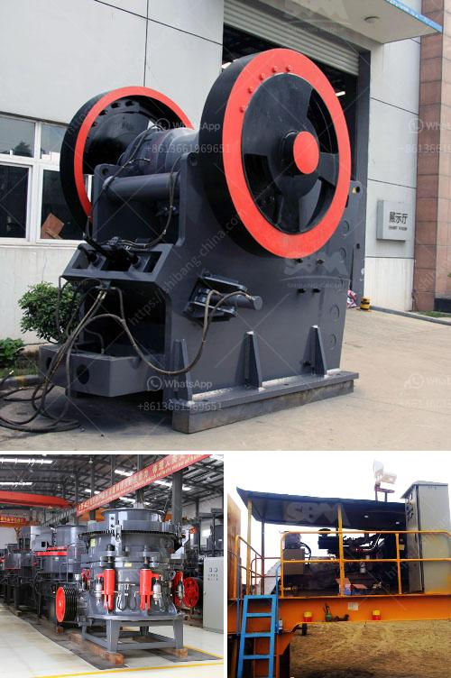

<h3>kenya electrical jaw crusher 32 x 58</h3>
Kenya, being a rapidly developing country in the African continent, has been witnessing a steady growth in various sectors. Infrastructural developments, construction projects, and mining activities are at an all-time high, demanding the need for efficient machinery that can handle the extensive workload. In this regard, the Kenya Electrical Jaw Crusher 32 x 58 has emerged as a game-changer, revolutionizing the crushing industry.

The electrical jaw crusher is a powerful machine, designed to efficiently crush large rocks into smaller particles. It boasts a jaw opening of 32 x 58 inches, allowing it to handle the toughest materials with ease. Whether it is hard granite or abrasive limestone, this crusher is capable of crushing it all. The large feed opening ensures a consistent and high throughput, enabling operators to achieve maximum productivity.

One of the key advantages of the Kenya Electrical Jaw Crusher 32 x 58 is its electrical operation. Unlike traditional diesel-powered crushers, this machine runs on electricity, reducing fuel consumption and emissions. This makes it an environmentally friendly choice while also benefiting operators with reduced operational costs. Additionally, the electrical operation eliminates the need for regular maintenance associated with diesel engines, ensuring a hassle-free crushing experience.

Furthermore, this jaw crusher is equipped with advanced features designed to enhance efficiency and ease of use. It comes with a user-friendly control panel that allows operators to adjust the settings and monitor the performance of the machine. The hydraulic system ensures quick and easy CSS (Closed Side Setting) adjustments, providing optimal particle size control.

Safety is also a key consideration in the design of the Kenya Electrical Jaw Crusher 32 x 58. It is equipped with various safety features such as an emergency stop button, overload protection, and a fully enclosed engine compartment. These measures ensure the safety of operators and minimize the risk of accidents on the worksite.

In conclusion, the Kenya Electrical Jaw Crusher 32 x 58 is a reliable and efficient machine that offers superior crushing capabilities. Its electrical operation, high throughput, and advanced features make it a preferred choice for various industries in Kenya. Whether it is road construction, building projects, or mining activities, this jaw crusher is equipped to handle the toughest materials with ease. With its emphasis on productivity, efficiency, and safety, this crusher is set to transform the crushing industry in Kenya and meet the growing demands of the nation's infrastructure development.
<h3>Contact us</h3><ul><li><strong>Whatsapp:&nbsp;<a href="https://wa.me/8613661969651">+8613661969651</a></strong></li><li><a href="https://swt.shibang-china.com/?git&amp;zhl&amp;kenya electrical jaw crusher 32 x 58"><strong>Online Service(chat now)</strong></a></li></ul><h3>Related</h3><ul><li><a href='vsi crusher manufacturers.md'>vsi crusher manufacturers</a></li><li><a href='granite quarry machines.md'>granite quarry machines</a></li><li><a href='philippines mining equipment companies.md'>philippines mining equipment companies</a></li><li><a href='price list coal crushing plant.md'>price list coal crushing plant</a></li><li><a href='aggregate crusher plants.md'>aggregate crusher plants</a></li></ul>