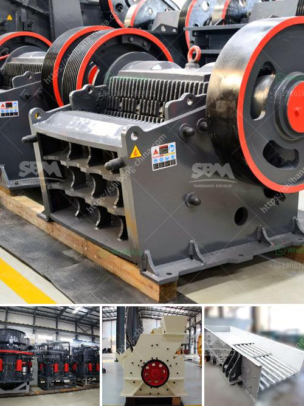

<h3>kenya jaw crusher is manufactured</h3>
Kenya is a country of diverse cultures and traditions. With a rich history spanning over millennia, the country is a melting pot of various ethnicities and customs. As Kenya continues to modernize and develop, its construction industry is booming. The need for high-quality construction materials, such as gravel, sand, and aggregates, is on the rise. Consequently, the demand for efficient and reliable rock crushers, like the Kenya jaw crusher, is increasing.

The Kenya jaw crusher is manufactured under the stringent quality control measures to ensure that the machines are error-free and high-performing. Available in different sizes and capacities, the jaw crushers in Kenya are widely used in various industries such as mining, construction, metallurgy, and many more. Their sturdy build, durable materials, and superior performance make them highly sought after in the market.

One of the main advantages of the Kenya jaw crusher is its versatility. It can efficiently crush a wide range of materials, from limestone to basalt, from concrete to granite. This makes it an ideal choice for different applications. Whether you need to crush rocks for road construction, break down large stones for building foundations, or reduce the size of materials for recycling purposes, the Kenya jaw crusher can effortlessly handle any task.

The jaw crusher in Kenya boasts a simple and reliable structure, ensuring easy operation and maintenance. Its user-friendly design allows operators to quickly and efficiently adjust the settings to meet their specific requirements. Additionally, the jaw crusher incorporates advanced technology features, such as hydraulic systems, which enhance its functionality and overall productivity.

With the growing concern for environmental conservation and sustainable practices, the Kenya jaw crusher is designed to minimize energy consumption and reduce carbon emissions. Its energy-efficient motor and optimized crushing chamber contribute to lower operating costs and an improved carbon footprint. This makes the Kenya jaw crusher an eco-friendly option for businesses and individuals alike.

To ensure customer satisfaction, manufacturers in Kenya offer comprehensive after-sales services, including installation, commissioning, and technical support. This guarantees that the jaw crusher is in perfect working condition and maximizes its lifespan. In addition, manufacturers provide spare parts and accessories, ensuring that the crusher can be repaired and maintained whenever necessary.

As Kenya continues to invest in infrastructure and development projects, the demand for high-quality rock crushers, like the Kenya jaw crusher, will continue to grow. The consistent and reliable performance of these machines makes them an indispensable tool for the construction industry. With their ease of operation, low maintenance requirements, and eco-friendly features, the Kenya jaw crusher has proven to be a game-changer in the crushing and mining industry.

In conclusion, the Kenya jaw crusher stands out as a revolutionary rock crusher that meets the growing demands of the construction industry. Its versatility, sturdy build, and advanced technology make it an ideal choice for various applications. As the country continues to grow and develop, the Kenya jaw crusher will continue to play a crucial role in providing high-quality construction materials for infrastructure projects.
<h3>Contact us</h3><ul><li><strong>Whatsapp:&nbsp;<a href="https://wa.me/8613661969651">+8613661969651</a></strong></li><li><a href="https://swt.shibang-china.com/?git&amp;zhl&amp;kenya jaw crusher is manufactured"><strong>Online Service(chat now)</strong></a></li></ul><h3>Related</h3><ul><li><a href='new stamp mill for sale in zimbabwe.md'>new stamp mill for sale in zimbabwe</a></li><li><a href='mill grinding machines for sale.md'>mill grinding machines for sale</a></li><li><a href='coal ball mill in india from coal dust.md'>coal ball mill in india from coal dust</a></li><li><a href='cost of converyer belts in south africa.md'>cost of converyer belts in south africa</a></li><li><a href='stone quarry business proposal.md'>stone quarry business proposal</a></li></ul>