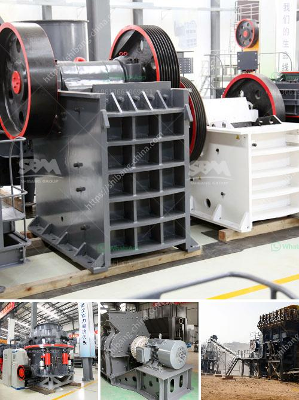

<h3>kohinoor stone crusher contact</h3>
Kohinoor Stone Crusher is a great example of a successful business that has thrived in the rugged terrain of Kangra district, located in the state of Himachal Pradesh. This small business has grown over the years and successfully gained recognition from various stakeholders including from government bodies. With its long-standing presence in the industry, Kohinoor Stone Crusher has emerged as the go-to place for quality construction material in the region.

Established in 2009, Kohinoor Stone Crusher is an innovative enterprise engaged in manufacturing, distributing, and supplying various types of construction materials. These include stone dust, sand, gravel, crushed stones, etc., which are extensively used in different construction projects. The quality of their products has always remained consistent and dependable.

One of the key factors that differentiates Kohinoor Stone Crusher from its competitors is its unwavering commitment to ensuring customer satisfaction. In an industry where the quality of construction materials varies widely, this small business has consistently focused on delivering the highest quality products each and every time. Customers have praised the company’s dedication towards maintaining high standards and their ability to meet project deadlines.

In addition to their commitment towards product quality, Kohinoor Stone Crusher is also highly regarded for its cordial and efficient customer service. The company maintains a well-trained and friendly team of professionals who are always ready to assist customers, addressing their queries, and guiding them in choosing the most suitable materials for their specific needs. This personalized approach has earned the company a loyal customer base.

To ensure a smooth supply chain and adequate stock, Kohinoor Stone Crusher has established its own crusher unit, located in the outskirts of Kangra district. This investment allows the business to have complete control over the production process, ensuring the availability of construction materials at all times. Additionally, the company has developed strategic partnerships with local suppliers to diversify their product range and cater to a wider range of customer requirements.

One of the key features that customers appreciate is the company’s competitive pricing policy. Understandably, cost is a crucial factor when it comes to purchasing construction materials for any project. Kohinoor Stone Crusher stands out by offering reasonably priced products without compromising on quality. Their pricing structure is transparent and doesn’t include hidden charges, thereby allowing customers to budget effectively and plan their construction projects efficiently.

Notably, Kohinoor Stone Crusher has also taken several steps towards ensuring environmental sustainability. The company follows all the requisite norms and regulations for the extraction of raw materials and ensures that the manufacturing processes are eco-friendly. Efforts are made to minimize waste production and recycle materials whenever possible, further highlighting their dedication towards responsible business practices.

Over the years, Kohinoor Stone Crusher has not only contributed to the construction industry but has also played an active role in supporting the local community. The company regularly engages in corporate social responsibility activities, such as organizing health camps and educational initiatives, which aim to uplift the lives of the people in the area.

In conclusion, Kohinoor Stone Crusher has established itself as a reputable and reliable supplier of construction materials in the Kangra district of Himachal Pradesh. Their unwavering commitment to providing high-quality products, along with their exceptional customer service and responsible business practices, has set them apart in the industry. With their long-standing presence and customer-oriented approach, Kohinoor Stone Crusher has earned the trust and loyalty of its clientele.
<h3>Contact us</h3><ul><li><strong>Whatsapp:&nbsp;<a href="https://wa.me/8613661969651">+8613661969651</a></strong></li><li><a href="https://swt.shibang-china.com/?git&amp;zhl&amp;kohinoor stone crusher contact"><strong>Online Service(chat now)</strong></a></li></ul><h3>Related</h3><ul><li><a href='professional granite cone crusher.md'>professional granite cone crusher</a></li><li><a href='construction debris recycling.md'>construction debris recycling</a></li><li><a href='jaw crushers sale.md'>jaw crushers sale</a></li><li><a href='screening plant for hire south africa.md'>screening plant for hire south africa</a></li><li><a href='coal processing plant in australia.md'>coal processing plant in australia</a></li></ul>