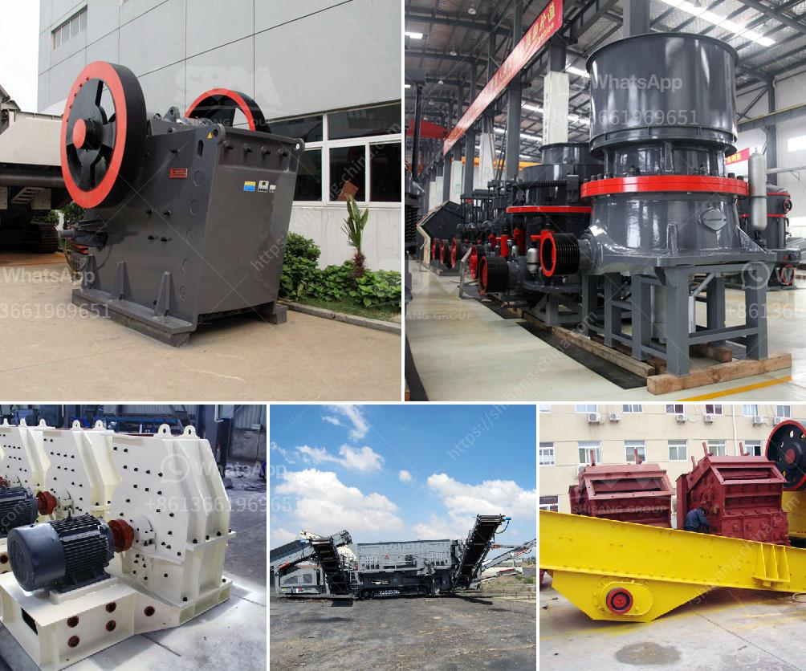

<h3>laporan praktikum jaw crusher dan analisis ayakan</h3>
Jaw Crusher merupakan salah satu peralatan pemecah batu yang paling banyak digunakan di dunia. Jenis mesin ini dapat digunakan untuk menghancurkan berbagai jenis batu, seperti batu kali, batu gunung, batu bara, dan sebagainya. Selain itu, jaw crusher juga memiliki kelebihan dalam pemeliharaan yang mudah dan operasional yang sederhana.

Laporan praktikum ini akan membahas tentang penggunaan jaw crusher dan analisis ayakan. Praktikum ini dilakukan dengan menggunakan jaw crusher tipe Blake yang beroperasi dengan prinsip tekanan.

Pada tahap awal praktikum, kami melakukan persiapan dan pengecekan terhadap jaw crusher. Beberapa komponen yang kami periksa meliputi bagian dalam crusher, seperti rahang (jaw plate), swing jaw, fixed jaw, dan chocky bars. Kami juga memeriksa sistem kontrol dan kelistrikan untuk memastikan bahwa semua komponen berfungsi dengan baik.

Setelah semua persiapan selesai, kami mulai melakukan pengujian praktikum. Kami menggunakan sampel batu yang telah ditentukan ukuran dan beratnya. Batu tersebut dimasukkan ke dalam jaw crusher dan dihancurkan menggunakan prinsip tekanan dari rahang yang bergerak ke arah ayunan.

Selama proses penghancuran, kami melakukan pengamatan terhadap beberapa parameter, seperti ukuran hasil yang dihasilkan, kecepatan putaran rahang, dan konsumsi energi. Kami mencatat semua data tersebut untuk keperluan analisis ayakan selanjutnya.

Setelah proses penghancuran selesai, kami melakukan analisis ayakan terhadap hasil dari jaw crusher. Ayakan adalah alat yang digunakan untuk memisahkan partikel-partikel berdasarkan ukurannya. Kami menggunakan beberapa ukuran ayakan yang berbeda untuk menganalisis ukuran partikel batu yang dihasilkan.

Hasil analisis ayakan menunjukkan bahwa jaw crusher mampu menghasilkan partikel-partikel batu dengan ukuran yang sesuai dengan kebutuhan pasir atau batu pecah yang dibutuhkan. Kami juga menemukan bahwa semakin kecil ukuran rahang yang digunakan dalam jaw crusher, semakin kecil pula ukuran partikel yang dihasilkan.

Selain itu, kami juga melakukan pengujian terhadap konsumsi energi dari jaw crusher. Dalam pengujian ini, kami mengukur berapa banyak energi yang digunakan untuk menghancurkan batu tersebut. Hasilnya menunjukkan bahwa jaw crusher memiliki konsumsi energi yang relatif rendah.

Dalam kesimpulan, jaw crusher merupakan peralatan pemecah batu yang sangat efektif dan efisien. Dalam praktikum ini, kami berhasil menghancurkan batu dengan ukuran yang sesuai dengan kebutuhan menggunakan jaw crusher tipe Blake. Analisis ayakan juga menunjukkan bahwa jaw crusher mampu menghasilkan partikel-partikel batu dengan ukuran yang diinginkan.

Praktikum ini memberikan pemahaman yang lebih baik tentang cara kerja jaw crusher dan kegunaannya dalam industri pemecah batu. Diharapkan laporan ini dapat menjadi referensi bagi mereka yang tertarik untuk menggunakan jaw crusher dalam kegiatan pemecahan batu.
<h3>Contact us</h3><ul><li><strong>Whatsapp:&nbsp;<a href="https://wa.me/8613661969651">+8613661969651</a></strong></li><li><a href="https://swt.shibang-china.com/?git&amp;zhl&amp;laporan praktikum jaw crusher dan analisis ayakan"><strong>Online Service(chat now)</strong></a></li></ul><h3>Related</h3><ul><li><a href='machine grinds talcum powder.md'>machine grinds talcum powder</a></li><li><a href='components of industrial conveyor belts.md'>components of industrial conveyor belts</a></li><li><a href='mobile coal crusher in philippines.md'>mobile coal crusher in philippines</a></li><li><a href='stone crusher vibrating screen for sale.md'>stone crusher vibrating screen for sale</a></li><li><a href='calcium carbonate process flow diagram.md'>calcium carbonate process flow diagram</a></li></ul>