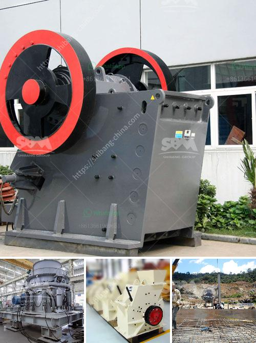

<h3>lime grinder unit lime size</h3>
Lime is a versatile chemical compound used in various industries, including agriculture, construction, and manufacturing. It is widely known for its ability to neutralize soil acidity, improve soil structure, and provide essential nutrients to plants. However, to effectively harness the benefits of lime, it is crucial to ensure the lime size is appropriate for the intended purpose. This is where the lime grinder unit plays a crucial role.

The lime grinder unit, also known as a lime mill or lime pulverizer, is a machine specifically designed to grind limestone or calcium carbonate into smaller particles. This process not only allows for easier handling and transportation but also provides the desired lime size required for specific applications.

One of the primary reasons for grinding lime is to increase its surface area. By reducing the lime size, the available surface area is maximized, enabling better contact with soil, water, and other materials. This increased surface area enhances the reactivity of lime, allowing it to dissolve more quickly and effectively. Consequently, micronized lime is often preferred over larger-sized lime particles in agriculture and horticulture.

In agriculture, the application of lime is crucial to adjust soil pH levels. However, the effectiveness of lime in neutralizing soil acidity largely depends on its size. Finer lime particles react faster with the soil, ensuring a more even distribution of nutrients and pH adjustment. Moreover, micronized lime promotes better soil aeration and drainage, as it can penetrate compacted soil more easily. This, in turn, enhances root development and increases crop yields.

The construction industry also benefits from lime grinder units, particularly in the production of lime mortar. Lime mortars composed of smaller-sized lime particles exhibit enhanced plasticity and workability. The improved texture allows for easier application, resulting in higher quality and more durable construction. Additionally, finer lime particles provide better adhesion, reducing the likelihood of cracks and improving overall structural integrity.

In manufacturing, lime grinder units play a crucial role in the production of lime-based products such as paints, plastics, and paper. The finely ground lime particles facilitate the incorporation and dispersion of lime into different formulations, ensuring consistent quality and performance.

When determining the appropriate lime size for specific applications, factors such as particle distribution, purity, and chemical composition should be considered. Particle size distribution refers to the range of particle sizes present in the lime product. Ideally, a product with a narrow size distribution is preferred, as it ensures uniformity and better mixing capabilities. Purity and chemical composition relate to the concentration of calcium carbonate in the lime, as impurities can affect its overall reactivity.

In conclusion, the lime grinder unit plays a critical role in optimizing the benefits of lime in various industries. By reducing the lime size, micronized lime offers improved reactivity, better distribution, and enhanced performance. Whether it's improving soil fertility in agriculture, enhancing construction materials, or enabling precise formulation in manufacturing, choosing the right lime size is essential for achieving desired results.
<h3>Contact us</h3><ul><li><strong>Whatsapp:&nbsp;<a href="https://wa.me/8613661969651">+8613661969651</a></strong></li><li><a href="https://swt.shibang-china.com/?git&amp;zhl&amp;lime grinder unit lime size"><strong>Online Service(chat now)</strong></a></li></ul><h3>Related</h3><ul><li><a href='crusher plants for sale.md'>crusher plants for sale</a></li><li><a href='how does a quarry operate complete crushing palnt.md'>how does a quarry operate complete crushing palnt</a></li><li><a href='alluvial gold mining equipment used for sale.md'>alluvial gold mining equipment used for sale</a></li><li><a href='crushing plants pawer screen.md'>crushing plants pawer screen</a></li><li><a href='slag processing plant in india.md'>slag processing plant in india</a></li></ul>