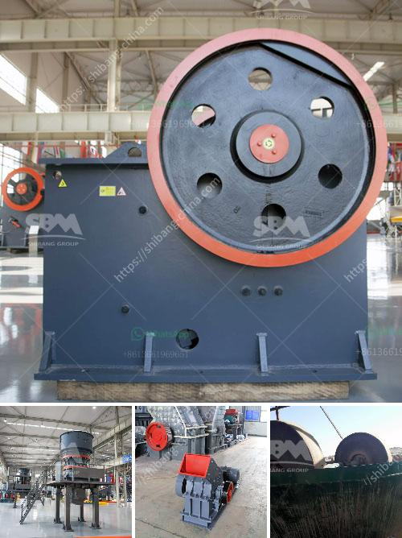

<h3>lime making machine</h3>
With the continuous advancement of technology, various industries have experienced a significant transformation, and the lime manufacturing industry is no exception. Lime, also known as calcium oxide, is a key ingredient used in a wide range of applications, including construction, agriculture, chemical manufacturing, and more. Traditionally, lime production involved a labor-intensive process that required considerable time and effort. However, with the introduction of lime making machines, this process has become streamlined and highly efficient.

A lime making machine is an innovative piece of equipment specifically designed to automate and simplify the lime manufacturing process. These machines leverage cutting-edge technology to produce high-quality lime in a faster and more cost-effective manner. They boast several advantages over the traditional manufacturing methods, making them an indispensable asset for lime producers.

One of the primary benefits of lime making machines is their ability to enhance productivity. They can produce a significantly larger quantity of lime compared to manual processes, ensuring a more consistent and reliable supply. These machines are capable of running continuously, minimizing downtime and maximizing output. This increased production capacity not only meets the rising demand for lime but also allows lime producers to expand their customer base and grow their business.

Furthermore, lime making machines improve the overall quality of the lime produced. They can precisely control the composition and properties of the lime, resulting in a more consistent and superior product. Automation ensures that the lime-making process remains standardized, reducing the risk of human error and eliminating variations in quality. As a result, lime manufacturers can deliver lime that meets the strictest industry standards, enhancing customer satisfaction and trust in their brand.

In addition to improving productivity and quality, lime making machines contribute to a more environmentally friendly manufacturing process. They incorporate advanced technologies that prioritize energy efficiency, reducing the consumption of resources and minimizing waste. These machines optimize the use of raw materials, ensuring that there is minimal lime wastage during the production process. This not only benefits the environment but also reduces costs for lime manufacturers, making them more economically sustainable.

Moreover, the introduction of lime making machines has significantly reduced the labor requirements for lime production. What used to be a labor-intensive process, involving multiple workers, can now be efficiently managed by a few operators overseeing the machines. This frees up human resources, allowing lime manufacturers to reallocate their manpower to other critical areas within their operations. As a result, they can enhance efficiency, cut labor costs, and focus on more value-added tasks such as research and development or market expansion.

In conclusion, the introduction of lime making machines has revolutionized the lime manufacturing industry. These machines have brought about significant improvements in productivity, quality, environmental sustainability, and labor efficiency. Lime producers now have the tools to meet the growing demand for lime, while ensuring a consistent supply of a high-quality product. As technology continues to advance, it is expected that lime making machines will become even more sophisticated and play a pivotal role in the future of lime production.
<h3>Contact us</h3><ul><li><strong>Whatsapp:&nbsp;<a href="https://wa.me/8613661969651">+8613661969651</a></strong></li><li><a href="https://swt.shibang-china.com/?git&amp;zhl&amp;lime making machine"><strong>Online Service(chat now)</strong></a></li></ul><h3>Related</h3><ul><li><a href='cheap stone crushing plant.md'>cheap stone crushing plant</a></li><li><a href='cs series cone crusher agents in south africa.md'>cs series cone crusher agents in south africa</a></li><li><a href='price list coal crushing plant.md'>price list coal crushing plant</a></li><li><a href='dense medium separation equipment supplier.md'>dense medium separation equipment supplier</a></li><li><a href='conveyor belt seller in korea.md'>conveyor belt seller in korea</a></li></ul>