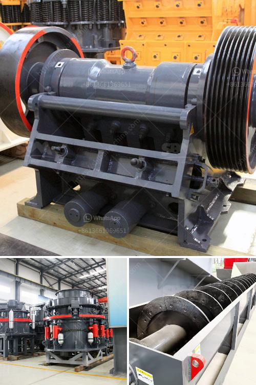

<h3>lime manufacturing process</h3>
Lime is a versatile and important industrial chemical used in various applications around the world. From water treatment and agriculture to construction and manufacturing, lime plays a vital role in improving and enhancing different processes. But have you ever wondered how lime is manufactured? Let’s explore the lime manufacturing process from quarry to production.

The process starts with the extraction of limestone, a sedimentary rock primarily composed of calcium carbonate, from a quarry. This requires drilling, blasting, and hauling of the rock. The extracted limestone is then crushed into smaller pieces to facilitate transportation to the lime production plant.

At the production plant, the crushed limestone is conveyed to a rotary kiln, a large cylindrical furnace where the limestone is heated to extremely high temperatures. This process is known as calcination. During calcination, the limestone undergoes a series of chemical reactions resulting in the release of carbon dioxide (CO2) and the formation of lime (calcium oxide).

Once the calcination process is complete, the lime is cooled and stored before further processing. It is important to note that producing lime generates CO2 emissions due to the release of CO2 during calcination. Therefore, lime manufacturers often employ various strategies and technologies to reduce their carbon footprint and minimize environmental impacts.

The next step is hydration, where water is added to the lime to produce hydrated lime (calcium hydroxide). This process involves carefully controlled amounts of water to ensure the desired consistency and properties are achieved. Hydrated lime has a multitude of applications, including water and wastewater treatment, soil stabilization, and building materials.

Finally, the hydrated lime may undergo additional processes depending on the intended application. For example, in the construction industry, lime may be mixed with cement, sand, and water to create mortar or used as a binder in the production of bricks and blocks.

In conclusion, lime manufacturing is a fascinating process that transforms limestone into a highly versatile industrial chemical. From quarrying and crushing to calcination, hydration, and beyond, the entire process is carefully managed to ensure the production of high-quality lime. As sustainability becomes a growing concern, lime manufacturers continue to innovate and develop greener technologies to minimize environmental impacts and contribute to a more sustainable future.
<h3>Contact us</h3><ul><li><strong>Whatsapp:&nbsp;<a href="https://wa.me/8613661969651">+8613661969651</a></strong></li><li><a href="https://swt.shibang-china.com/?git&amp;zhl&amp;lime manufacturing process"><strong>Online Service(chat now)</strong></a></li></ul><h3>Related</h3><ul><li><a href='about aggregate crusher plants.md'>about aggregate crusher plants</a></li><li><a href='vibrating screen for 150 microns.md'>vibrating screen for 150 microns</a></li><li><a href='how to set up a stone quarry company.md'>how to set up a stone quarry company</a></li><li><a href='stone crusher to make gravel.md'>stone crusher to make gravel</a></li><li><a href='ball mill prices and for sale ghana.md'>ball mill prices and for sale ghana</a></li></ul>