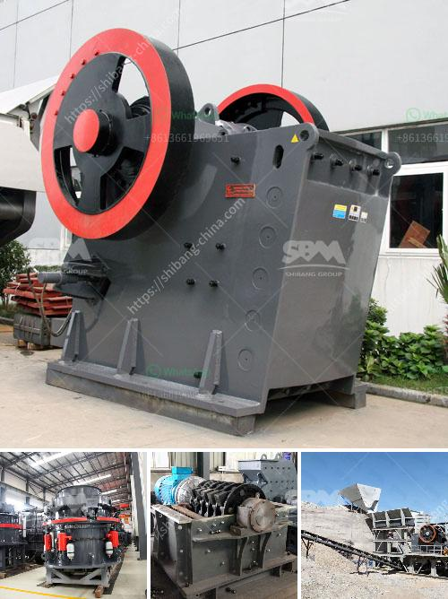

<h3>lime plant manufacturer in turkey</h3>
Lime plants play a crucial role in various industries, ranging from steel and cement production to water treatment and sugar refining. Turkey, with its diverse industrial landscape, is home to several lime plant manufacturers, providing high-quality equipment and solutions to both domestic and international markets.

One notable lime plant manufacturer in Turkey is known for its extensive experience and technological expertise. With a track record spanning decades, this company has established itself as a reliable and innovative partner in the lime industry. 

The manufacturer offers a comprehensive range of lime kilns, plant automation systems, and lime hydrating plants. These state-of-the-art products are designed to meet the specific needs and requirements of individual clients, ensuring efficient and sustainable lime production. 

Moreover, the manufacturer emphasizes sustainability by implementing environmentally friendly technologies in its lime plants. With a focus on reducing energy consumption and emissions, these plants operate in harmony with stringent environmental regulations. 

The lime plant manufacturer in Turkey also provides turnkey solutions, simplifying the lime production process for clients. From conceptualization and design to installation, commissioning, and after-sales support, the manufacturer offers a seamless experience, ensuring the success and longevity of lime production facilities. 

What sets this lime plant manufacturer apart is its commitment to innovation and continuous improvement. By investing in research and development, the company consistently introduces new technologies and advancements to enhance the quality and efficiency of lime production. This dedication to innovation has garnered recognition and trust from clients worldwide. 

In conclusion, Turkey's lime plant manufacturers deliver world-class solutions to meet the growing demand for lime in various industries. With their expertise, sustainability focus, and commitment to innovation, these manufacturers play a crucial role in supporting the industrial progress of the country and beyond.
<h3>Contact us</h3><ul><li><strong>Whatsapp:&nbsp;<a href="https://wa.me/8613661969651">+8613661969651</a></strong></li><li><a href="https://swt.shibang-china.com/?git&amp;zhl&amp;lime plant manufacturer in turkey"><strong>Online Service(chat now)</strong></a></li></ul><h3>Related</h3><ul><li><a href='stone crusher in pakistan.md'>stone crusher in pakistan</a></li><li><a href='stone crusher price.md'>stone crusher price</a></li><li><a href='vail crushing meachine models in pharma.md'>vail crushing meachine models in pharma</a></li><li><a href='quartz grinding machines.md'>quartz grinding machines</a></li><li><a href='cost of cassava milling machine in ghana.md'>cost of cassava milling machine in ghana</a></li></ul>