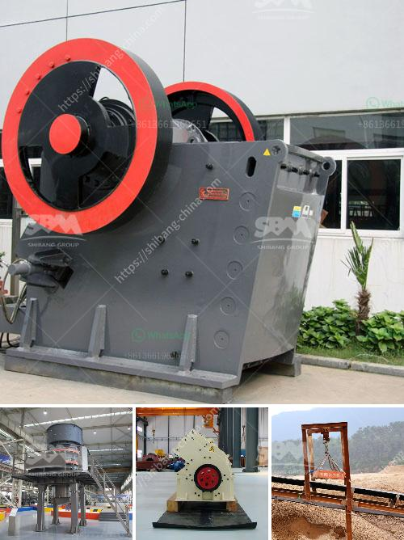

<h3>lime processing plant</h3>
Lime processing plants play a crucial role in the overall lime production process. These plants help in converting raw limestone (calcium carbonate) into quicklime (calcium oxide), which is an essential ingredient used in various industries including construction, agriculture, and chemical manufacturing.

The lime processing plant typically consists of several steps, starting from the extraction of limestone from mines or quarries. Once extracted, the limestone is crushed into smaller sizes and transported to the plant. At the plant, the limestone undergoes a series of processes including drying, crushing, and calcining.

Drying is an important step as it reduces the moisture content of limestone, making it easier to handle and process. After drying, the limestone is crushed into smaller sizes to enhance its reactivity during the calcining process. Calcining is the core step where limestone is heated at high temperatures, typically around 900-1000 degrees Celsius. This process causes the limestone to undergo a chemical transformation, converting it into quicklime.

The quicklime produced at the lime processing plant is then cooled and stored in silos before being transported to various industries. Quicklime is highly reactive and has several applications. It is commonly used in the production of cement, where it acts as a binding agent. Additionally, quicklime is used in agriculture to neutralize acidic soils, improve soil structure, and enhance crop yields. It is also utilized in the steel and chemical industries for various purposes.

A well-designed lime processing plant ensures the production of high-quality quicklime that meets industry standards. These plants must adhere to environmental regulations and implement measures to minimize emissions and waste generation. The efficient operation of lime processing plants is essential for ensuring a sustainable supply of quicklime to industries, thereby supporting economic growth and development.

In conclusion, lime processing plants are an integral part of the lime production process. These plants transform raw limestone into valuable quicklime, which serves as a vital ingredient in several industries. With their ability to convert limestone into a versatile product, lime processing plants play a fundamental role in supporting various sectors and contributing to economic progress.
<h3>Contact us</h3><ul><li><strong>Whatsapp:&nbsp;<a href="https://wa.me/8613661969651">+8613661969651</a></strong></li><li><a href="https://swt.shibang-china.com/?git&amp;zhl&amp;lime processing plant"><strong>Online Service(chat now)</strong></a></li></ul><h3>Related</h3><ul><li><a href='quartz stone production line machinery.md'>quartz stone production line machinery</a></li><li><a href='limestone crusher and grinder.md'>limestone crusher and grinder</a></li><li><a href='powder making machine price in pakistan.md'>powder making machine price in pakistan</a></li><li><a href='bauxite from cement plants in india.md'>bauxite from cement plants in india</a></li><li><a href='small mechanical jaw crusher singapore.md'>small mechanical jaw crusher singapore</a></li></ul>