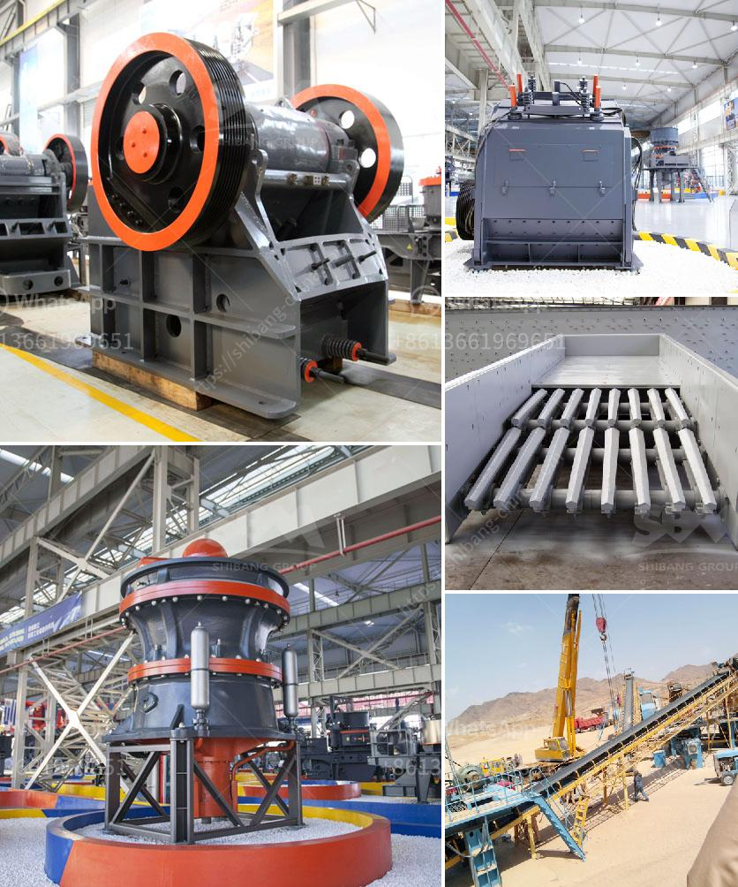

<h3>lime stone crusher machine manufacturing company china</h3>
Limestone is a sedimentary rock composed mostly of calcium carbonate (CaCO3), which is used as a building material and industrial raw material. It is widely used in industries such as construction, agriculture, chemicals, ceramics, metallurgy and environmental protection. The global limestone market is growing rapidly due to the increasing demand for various limestone-based products.

In China, as one of the largest limestone producing countries, government has paid more attention to limestone crushing project. In recent years, many local governments have invested heavily in mining and processing limestone to meet the increasing demand for construction materials and improve the local economy.

With the development of China's economy, the limestone crusher manufacturers in China have also gradually increased. It is understood that China's limestone crushing production line manufacturers are mainly distributed in Henan, Guangdong, Zhejiang and other places, with dozens of limestone crushing production lines built every year.

The continuous advancement of science and technology and the development of nanotechnology have greatly promoted the development of various industries in China. Especially in the field of mechanical equipment, the breakthrough of crushing theory and technology has created a new field of limestone crushing in China. The jaw crusher, hammer crusher, impact crusher, cone crusher and other equipment developed by leading Chinese manufacturing companies are the core products of China's mining industry.

In the process of limestone crushing, jaw crusher is the most widely used crusher. Because it has simple structure, reliable performance, and easy maintenance, jaw crusher is widely used for different projects in the construction industry. For example, in highway construction, jaw crusher can be used to process limestone into smaller sizes for roadbed construction. With the advancement of technology, jaw crusher can also achieve a significant breakthrough in crushing hard materials such as granite, basalt, and iron ore.

In addition to jaw crushers, there are also impact crushers, cone crushers, hammer crushers, etc., which are more flexible and can meet different crushing requirements. As the demand for limestone products in the construction industry continues to increase, the requirements for limestone crushers are also increasing. The limestone crusher manufacturing companies in China provide high-quality crushing machinery with reasonable prices for various limestone crushing projects.

Due to the development and advancement of limestone crushing technology in China, the demand for limestone crusher manufacturers in China is also increasing. Since China has a large number of limestone resources and many limestone production lines are located in remote and sparsely populated areas, the transportation costs of limestone crushers are relatively high. Therefore, some local governments in China encourage local limestone crusher manufacturers to make further technological advancements, including improving energy efficiency and reducing transportation costs.

As a crusher manufacturing company in China, Aimix Group mainly produces jaw crusher, cone crusher, impact crusher and other products with good quality and reasonable price. According to different requirements of customers, various types of crushers can be provided. Welcome to contact us for more details if you are interested in our products.

In conclusion, China's limestone crusher manufacturing companies have always been the focus of attention in the industry. With the development of China's economy, the demand for limestone crushers has gradually increased, and the market is full of fierce competition. It is suggested that limestone crusher manufacturers should actively innovate, improve their technological level and equipment quality, and create higher value for customers.
<h3>Contact us</h3><ul><li><strong>Whatsapp:&nbsp;<a href="https://wa.me/8613661969651">+8613661969651</a></strong></li><li><a href="https://swt.shibang-china.com/?git&amp;zhl&amp;lime stone crusher machine manufacturing company china"><strong>Online Service(chat now)</strong></a></li></ul><h3>Related</h3><ul><li><a href='gold stamp mills in zimbabwe.md'>gold stamp mills in zimbabwe</a></li><li><a href='cement ball mills charging.md'>cement ball mills charging</a></li><li><a href='pulverizer crusher manufacturer in chennai.md'>pulverizer crusher manufacturer in chennai</a></li><li><a href='equipment of gold mining.md'>equipment of gold mining</a></li><li><a href='stone crushing plants close to rotate.md'>stone crushing plants close to rotate</a></li></ul>