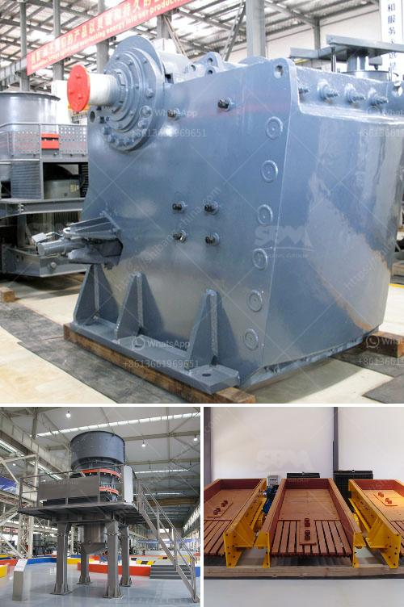

<h3>lime stone crushing plant india</h3>
Limestone is an important mineral resource in India. The extracted limestone need to be crushed and prepared for further processing. The raw limestone materials are subjected to primary size reduction by a primary jaw crusher operating at a capacity of 50-60 TPH. The primary crushed limestone is conveyed to a vibrating screen for size classification. The stone that is too large to pass through the top deck of the screen is processed in the secondary cone crusher.

Some crushing plant requires tertiary crushing, which is usually performed using cone crushers or other types of impact crushers. Limestone ore crushing machine price is different according to crusher types and production capacity.

Limestone ore material is reduced in size by blasting and then visually evaluated for quality. After blasting, the fragmented material is loaded and transported to the grinding and sorting plant. The limestone ore material is crushed in primary and secondary crushing and conveyed to the storage hopper. Each type of crusher is different and used to achieve a certain end result.

Similarly, a certain output is expected at the end of each crushing stage for the next phase of the process. Aggregate producers who pair the correct crusher to the correct stage will be the most efficient and, in turn, the most profitable.

Most aggregate producers are well acquainted with the selection of crushing equipment and know it is possible to select a piece of equipment based solely on spec sheets and gradation calculations. However, theoretical conclusions must always be weighed against practical experience regarding the material at hand and of the operational, maintenance and economical aspects of different solutions.

Although limestone deposits are found in every state, only a small portion is pure enough for industrial lime manufacturing. To be classified as limestone, the rock must contain at least 50 percent calcium carbonate. The controlled slaking of quicklime with water gives us white dry powder then the released heat of reaction is captured and the extra slaked lime pounds are precipitated into tanks.

The extracted limestone need to be crushed and prepared for further processing. The raw limestone materails are subjected to primary size reduction by a primary crusher (hammer) operating at a capacity of 50-60 TPH. The particular limestone materials are subjected to secondary size reduction by a pulverizer to produce additional sales volumes of fine materials. These materials are then transported to the processing plant for further size reduction by limestone crushers.

The main crushing plant is divided into two different types, namely, the impact crusher and limestone cone crusher. The impact crusher is suitable for crushing medium hard materials, while the cone crusher is suitable for crushing hard materials.

There are various uses of crushed stones, in rail road ballast, laying of roads, in concrete, plastering etc. The reduction of materials such as stone, slag or coal to suitable size for their indented use is done with equipments called crushers and pulverizes. Every year new roads are layed, old roads repaired and many new buildings are coming up, so there is great demand for crushed stones.

Investment in such equipment can bring huge profits. SBM Machinery, a professional ore beneficiation equipment manufacturer in China, can supply various types of limestone crusher, pulverizing and grinding machines with high quality, reasonable price and good service.
<h3>Contact us</h3><ul><li><strong>Whatsapp:&nbsp;<a href="https://wa.me/8613661969651">+8613661969651</a></strong></li><li><a href="https://swt.shibang-china.com/?git&amp;zhl&amp;lime stone crushing plant india"><strong>Online Service(chat now)</strong></a></li></ul><h3>Related</h3><ul><li><a href='how to put together a stone crusher.md'>how to put together a stone crusher</a></li><li><a href='roller crusher discount.md'>roller crusher discount</a></li><li><a href='used dolomite jaw crusher price malaysia.md'>used dolomite jaw crusher price malaysia</a></li><li><a href='vertical roller mill industrial.md'>vertical roller mill industrial</a></li><li><a href='how to make a iron ore crusher machine.md'>how to make a iron ore crusher machine</a></li></ul>