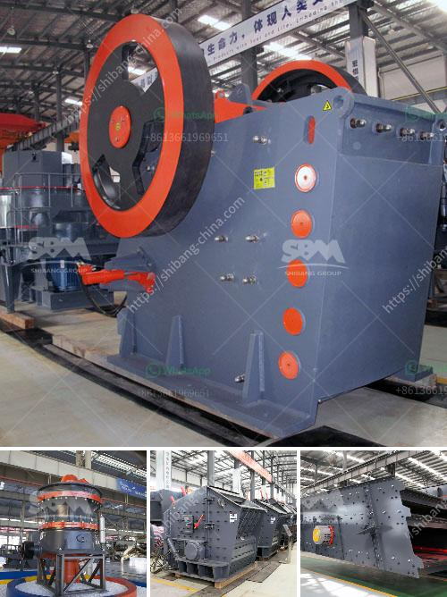

<h3>limestone and dolomite crusher plant</h3>
Limestone and dolomite are two kinds of precious resources with extremely wide applications. In the modern industries, they are important industrial raw materials for metallurgy, building materials, chemical industry, light industry, construction, agriculture and other special industries. With the development of these social productions, it is increasingly important to use limestone and dolomite materials. Since the erratic consumption of these resources poses a threat to the global environment, the use of efficient crusher plants is considered a crucial backbone for sustainable development.

In recent years, the limestone and dolomite have been extensively mined and utilized, resulting in excessive overexploitation. Increasing awareness about environmental issues has led to stricter regulations on mining and natural resource utilization. As a result, the crusher plants are becoming more important when it comes to handling these resources in an efficient and sustainable manner.

Unlike the traditional crushers, mobile limestone and dolomite crushing plants can save a lot of infrastructure investment costs. The machine can be operated remotely and has a compact design, making it suitable for small and medium-sized mines or stone quarries. It has the advantages of stable and reliable operation, low failure rate, less maintenance and operating costs, and low production and construction costs.

Price: The price is determined by the market and depends on the crushing capacity and production scale of the equipment. The prices of different manufacturers are definitely different, because they are in different stages of competition in the market. However, SBM's prices are more favorable.

The limestone and dolomite crusher plant is mainly composed of vibrating feeder, jaw crusher, impact crusher, vibrating screen, belt conveyor and other components. The overall design has strong stability, low maintenance, and reliable operation. The equipment operation is stable, and the failure rate is low.

The specifications of crushing, screening and mechanical equipment can be selectively matched and combined, with the production capacity ranging from 30t/h to 500t/h.

The complete set of mobile crushing and screening equipment mainly consists of primary crushing, secondary crushing, screening equipment, conveyor and other equipment. At present, there are many types of crushers, including jaw crusher, cone crusher, impact crusher and so on. Among them, the impact crusher is a more widely used crusher.

Limestone and dolomite are naturally occurring rocks that are commonly used in construction, agriculture and industry. They are quarried and processed to produce various forms of crushed rock such as gravel, crushed stone, and sand. The output of the plant is about 20 to 200 TPH (Tonnes per hour), and in many applications, the production capacity of this crushing plant is easy to be compared for both fixed crushing plant and mobile crushing plant.

SBM Company will provide different types of limestone and dolomite crusher machines to meet different requirements and provide customers with high-quality and efficient technical services.
<h3>Contact us</h3><ul><li><strong>Whatsapp:&nbsp;<a href="https://wa.me/8613661969651">+8613661969651</a></strong></li><li><a href="https://swt.shibang-china.com/?git&amp;zhl&amp;limestone and dolomite crusher plant"><strong>Online Service(chat now)</strong></a></li></ul><h3>Related</h3><ul><li><a href='slag processing plant in india.md'>slag processing plant in india</a></li><li><a href='stone crusher plant kyc.md'>stone crusher plant kyc</a></li><li><a href='clay ball mill machine browns.md'>clay ball mill machine browns</a></li><li><a href='malaysia quarry crusher peninsula.md'>malaysia quarry crusher peninsula</a></li><li><a href='clay ceromic manufacturing process.md'>clay ceromic manufacturing process</a></li></ul>