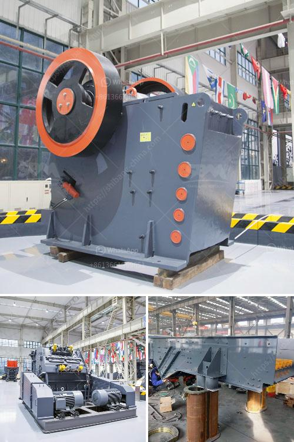

<h3>limestone crusher and grinder</h3>
Limestone is a sedimentary rock that is mainly composed of calcium carbonate (CaCO3). Limestone is widely used in various industries such as construction, water treatment, agriculture, and chemicals. It is also commonly used as a building material and as a raw material in the production of cement.

To make use of limestone, we need limestone crusher and limestone grinder. Here we recommend firstly use primary jaw crusher + fineness jaw crusher/compound cone crusher as the primary and secondary crushers, take the impact crusher as the tertiary crusher to shaping the stones.

This crushing process requires a large amount of equipment, including jaw crushers, impact crushers, cone crushers, vibration feeders, vibration screens, belt conveyors, and grinding mills. All of this equipment needs to be equipped with different types and specifications according to different crushing and production requirements.

The limestone crushers and grinders are specifically designed for such applications that require efficiency, durability, and reliability in the processing of limestone. So the limestone crusher and limestone grinder mill are necessary equipments in the limestone crushing plant.

To ensure the quality of limestone products, it is important to choose suitable limestone crushers and limestone grinders based on the characteristics of limestone, such as the hardness, density, shape, and moisture content. The limestone crushing plant should adopt high-quality crushers and grinders to provide reliable operation and high efficiency.

In conclusion, the limestone crusher and limestone grinder should be chosen by specific requirements considering the specific crushing and grinding applications as well as the investment capital in the early period to optimize the development of limestone utilization.
<h3>Contact us</h3><ul><li><strong>Whatsapp:&nbsp;<a href="https://wa.me/8613661969651">+8613661969651</a></strong></li><li><a href="https://swt.shibang-china.com/?git&amp;zhl&amp;limestone crusher and grinder"><strong>Online Service(chat now)</strong></a></li></ul><h3>Related</h3><ul><li><a href='mini stone crushers for small scale mining.md'>mini stone crushers for small scale mining</a></li><li><a href='mills price of hammer mills.md'>mills price of hammer mills</a></li><li><a href='floatation equipment for mining for sale in south africa.md'>floatation equipment for mining for sale in south africa</a></li><li><a href='balls for ball mill.md'>balls for ball mill</a></li><li><a href='jaw crusher for sale philippines.md'>jaw crusher for sale philippines</a></li></ul>