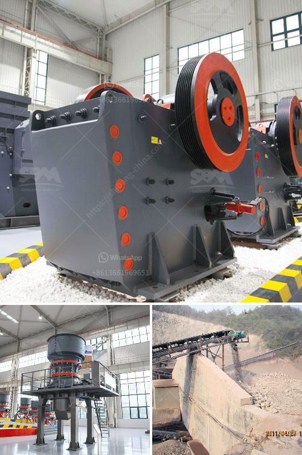

<h3>limestone crusher limestone crusher equipment</h3>
Limestone is a sedimentary rock composed largely of the minerals calcite and aragonite, which are different crystal forms of calcium carbonate (CaCO3). Limestone has numerous uses as a building material, an essential component of concrete, as aggregate for the base of roads, as white pigment or filler in products such as toothpaste or paints, and as a chemical feedstock.

To obtain limestone, it is necessary to break it down into manageable pieces so that it can be processed further. This is where a limestone crusher comes into play. Limestone crushers are capable of breaking down the stone size into smaller pieces.

To find the right limestone crusher for your needs, it is important to consider the various factors that must be taken into account. It is crucial to choose a reliable limestone crusher supplier that has experience in the field and can offer high-quality products at competitive prices.

One key factor to consider is the input size of the material. Ideally, the limestone should be fixed on the feeding machine or hopper before the primary crushing stage, which reduces the burden on the primary crusher and improves its efficiency.

Another consideration is the output size requirement. Different applications may require different sizes of crushed limestone. Depending on the final desired product, it is crucial to select a limestone crusher that can produce the required output efficiently.

The type of limestone crusher selected will play a critical role in the final product. Jaw crushers have larger crushing ratios, producing a more uniform size of limestone compared to other types of crushers. Impact crushers can crush limestone in a uniform cubic shape, making it the ideal choice for secondary or tertiary crushing.

The limestone crusher equipment also depends on the type of job you are doing. If you are on a construction site, mobile limestone crushers will be a more efficient choice, as they can be easily transported from one site to another.

When choosing a limestone crusher, it is essential to ensure that the equipment is durable and can withstand the tough conditions of the job site. Look for crushers that are made of high-quality materials and have a robust design to ensure longevity and minimum downtime.

Maintenance is another crucial factor to consider when selecting a limestone crusher. Regular maintenance and proper care can extend the life of the equipment and prevent costly repairs. It is important to choose a limestone crusher supplier that offers excellent after-sales service, ensuring any issues are resolved promptly.

In conclusion, a limestone crusher is an essential piece of equipment in limestone quarrying operations. It is used to break down the large limestone into smaller pieces suitable for further processing. When choosing a limestone crusher, it is crucial to consider factors such as input size, output size requirement, durability, and maintenance. By selecting the right limestone crusher, you can ensure efficient and cost-effective limestone processing, leading to high-quality end products.
<h3>Contact us</h3><ul><li><strong>Whatsapp:&nbsp;<a href="https://wa.me/8613661969651">+8613661969651</a></strong></li><li><a href="https://swt.shibang-china.com/?git&amp;zhl&amp;limestone crusher limestone crusher equipment"><strong>Online Service(chat now)</strong></a></li></ul><h3>Related</h3><ul><li><a href='equipment for gold refinery.md'>equipment for gold refinery</a></li><li><a href='hammer grinding machine philippines.md'>hammer grinding machine philippines</a></li><li><a href='dolomite powder making equipment.md'>dolomite powder making equipment</a></li><li><a href='marble crusher and grinding machinery.md'>marble crusher and grinding machinery</a></li><li><a href='grinder rock crusher.md'>grinder rock crusher</a></li></ul>