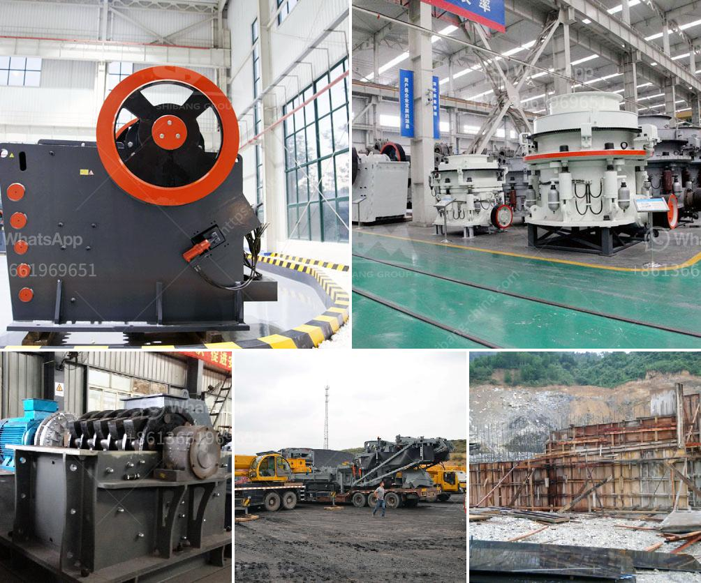

<h3>limestone crusher secondary machine price</h3>
Limestone is a common sedimentary rock found all over the world. The primary constituent of limestone is calcite, and the secondary component is usually dolomite. The formation of limestone is a result of various biological and physical processes, such as the accumulation of shells, algae, and coral over millions of years.

Limestone has been widely used in the construction industry for centuries due to its durability and versatility. It is commonly used as a building material, for road construction, and in the production of cement.

To extract limestone from quarries or mines, the initial step involves drilling holes into the ground and blasting the rocks using explosives. The fragmented rocks are then loaded into large trucks to be transported to the primary crusher, where they are crushed into smaller pieces.

The primary crusher is an essential machine in the limestone crushing process. Large pieces of limestone are fed into the crusher and subjected to a primary crushing process, reducing them to a size of about 6-8 inches in diameter. Smaller secondary crushers can then be used to further break down the limestone into even smaller pieces.

Secondary crushing machines are essential equipment in the limestone processing industry. They are used to further reduce the size of the limestone after the primary crushing process. These machines come in different types and sizes, depending on the desired end-product specification.

One of the commonly used limestone secondary crushers is the cone crusher. With the advantages of high crushing efficiency, large capacity, and easy maintenance, cone crushers are being used more and more in limestone processing applications. Cone crushers can process a wide range of materials, including soft, medium-hard, and hard stones.

Another type of secondary crusher used in the limestone processing industry is the impact crusher. This machine is designed to break down large chunks of limestone into smaller pieces and produce well-defined particles. Impact crushers are known for their high reduction ratios and excellent cubic shape of aggregates.

When considering the price of limestone crusher secondary machines, several factors need to be taken into account. The capacity of the machine, the size and hardness of the limestone, and the production requirements all play a crucial role in determining the price.

Generally, larger, more powerful machines with higher capacities tend to have higher prices. Additionally, machines with advanced features, such as automated settings control, remote operation capabilities, and energy-saving technologies, may also come at a higher cost.

It is essential to consider the long-term benefits and return on investment when evaluating the price of limestone crusher secondary machines. A machine with higher upfront costs but better efficiency and productivity may result in substantial cost savings over time.

In conclusion, limestone crusher secondary machines are crucial equipment in the limestone processing industry. They are used to further reduce the size of the limestone after primary crushing, producing well-defined particles for various construction applications. The price of these machines depends on several factors, including capacity, size and hardness of the limestone, and specific production requirements. Considering the long-term benefits and return on investment is important when evaluating the price of these machines.
<h3>Contact us</h3><ul><li><strong>Whatsapp:&nbsp;<a href="https://wa.me/8613661969651">+8613661969651</a></strong></li><li><a href="https://swt.shibang-china.com/?git&amp;zhl&amp;limestone crusher secondary machine price"><strong>Online Service(chat now)</strong></a></li></ul><h3>Related</h3><ul><li><a href='kohinoor stone crusher contact.md'>kohinoor stone crusher contact</a></li><li><a href='jaw crusher for sale philippines.md'>jaw crusher for sale philippines</a></li><li><a href='ball mill ball manufacturer in mumbai.md'>ball mill ball manufacturer in mumbai</a></li><li><a href='gold mining equipment pdf.md'>gold mining equipment pdf</a></li><li><a href='quarrying crusher machine.md'>quarrying crusher machine</a></li></ul>