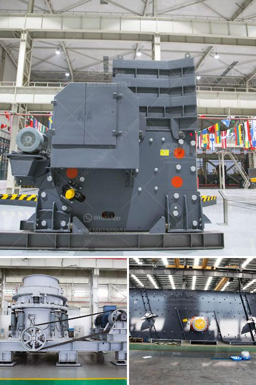

<h3>limestone crushers for chicken feed production</h3>
Limestone, a sedimentary rock composed primarily of calcium carbonate (CaCO3), is commonly used in the poultry industry as a feed supplement. The addition of limestone to chicken feed can have several benefits for both the chickens and humans who consume their products. To meet the growing demand for poultry products, efficient and advanced limestone crushers are being employed in the chicken feed production process.

One of the key benefits of using limestone in chicken feed is its ability to provide a balanced source of calcium. Calcium is an essential mineral required for proper growth and development in chickens. It plays a vital role in bone formation, eggshell quality, nerve function, and muscle contractions. Incorporating limestone into chicken feed helps supply the necessary calcium levels for optimal skeletal strength, preventing irregularities such as weak bones and impaired egg production.

Additionally, limestone in chicken feed aids in improving the overall digestibility of nutrients. Along with its calcium content, limestone also contains magnesium and phosphorus, which can enhance nutrient absorption and utilization in the chicken's digestive system. This leads to better feed conversion, ensuring that the chickens get the most out of the feed they consume. Consequently, it helps optimize growth rates and weight gain, promoting healthier and more efficient chicken farming practices.

Moreover, limestone crushers play a pivotal role in maintaining the acid-base balance within a chicken's digestive system. Chickens, like humans, require a slightly acidic environment for proper digestion. However, excessive acidity can lead to digestive disorders like acidosis, which affects nutrient absorption and overall health. By incorporating limestone into the feed, the calcium carbonate acts as a buffer, neutralizing excessive acidity and maintaining an ideal pH level in the chicken's digestive tract.

In order to meet the growing demand for chicken feed, efficient and reliable limestone crushers are crucial. These crushers are designed to effectively crush and pulverize limestone rocks into fine particles suitable for inclusion in feed mixes. A variety of crushing machines are available, including jaw crushers, impact crushers, and cone crushers, each with its own unique features and advantages.

Jaw crushers are known for their simplicity and robustness. They are capable of handling large pieces of limestone and can produce uniform-sized particles. Impact crushers, on the other hand, are often used for secondary or tertiary crushing. They utilize the principle of impact to break down limestone rocks into smaller fragments. Lastly, cone crushers offer precise and efficient crushing, ensuring high-quality limestone particles.

The utilization of limestone crushers in chicken feed production not only improves the poultry farming industry but also benefits the consumers. Chickens fed with high-quality limestone-enriched feeds result in healthier birds, improved egg production, and better meat quality. Furthermore, consumers can enjoy the assurance of consuming poultry products that are enriched with essential minerals and produced through sustainable and efficient methods.

In conclusion, limestone crushers are vital for the chicken feed production process as they enable the industry to meet the demand for high-quality poultry products. By supplementing chicken feed with limestone, the nutritional needs of chickens are met, resulting in stronger bones, improved digestion, and overall better bird health. Therefore, investing in efficient limestone crushers is crucial for the continuous growth and improvement of the chicken farming industry.
<h3>Contact us</h3><ul><li><strong>Whatsapp:&nbsp;<a href="https://wa.me/8613661969651">+8613661969651</a></strong></li><li><a href="https://swt.shibang-china.com/?git&amp;zhl&amp;limestone crushers for chicken feed production"><strong>Online Service(chat now)</strong></a></li></ul><h3>Related</h3><ul><li><a href='start m sand unit kerala cost.md'>start m sand unit kerala cost</a></li><li><a href='rock hammer mill for sale.md'>rock hammer mill for sale</a></li><li><a href='quartz stone crusher manufacturing machines.md'>quartz stone crusher manufacturing machines</a></li><li><a href='tph stone crushers with vsi in india.md'>tph stone crushers with vsi in india</a></li><li><a href='mobile crushing provider.md'>mobile crushing provider</a></li></ul>