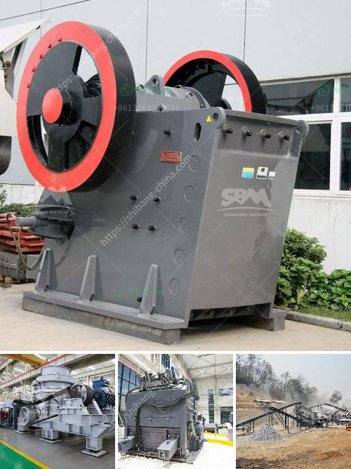

<h3>limestone crushers in ghana</h3>
Limestone mining in Ghana is quite prevalent, and the raw material is used for several purposes in different sectors of the economy. The country is home to four major limestone deposits, which are used by various industries, such as cement production, agriculture, and construction.

Limestone is a sedimentary rock composed mainly of calcium carbonate (CaCO3). It is formed from the remains of ancient marine organisms and is widely distributed in Ghana. Limestone deposits can be found in the Volta, Western, Ashanti, and Northern regions. These deposits are estimated to be over 1.5 billion metric tons.

One of the main uses of limestone in Ghana is in the cement industry. Limestone is the major raw material for cement production since it has low impurities and high calcium oxide content. Several cement companies operate limestone quarries to produce the required limestone for cement production. These quarries use heavy equipment such as crushers to break down the limestone into small pieces and transport them to the cement plant.

Limestone crushers are used in a variety of applications throughout the country. They are predominantly used in quarrying, mining, construction, and recycling. Limestone crushers can be used to crush both soft and hard rocks and ores, offering advanced reliability and durability.

The use of limestone crushers in Ghana can be beneficial to the country's economy. Ghana is a developing country, with a high poverty rate. There is an urgent need for jobs and economic growth. Investing in limestone crushers is a key step towards expanding the mining industry and generating revenue.

Limestone crushing equipment in Ghana plays an important role in the mining process, from the quarrying of the limestone to crushing the rocks into the required sizes. Crushers are also used in the construction industry to break down large stones into smaller pieces to be used for construction projects. This promotes the growth of the construction sector, providing employment opportunities and contributing to the country's infrastructure development.

Additionally, limestone crushers are essential for agriculture in Ghana. Limestone can be used as a soil conditioner and in the production of fertilizers. The crushed limestone is spread on farmlands to neutralize soil acidity and provide essential nutrients for crop growth. This enhances agricultural productivity, contributing to food security and reducing the dependence on imported fertilizers.

In conclusion, limestone crushers are crucial in the development of Ghana. The country has an abundance of limestone deposits, which can be harnessed for various applications. Investing in limestone crushers will not only boost the mining and construction sectors but also contribute to the growth of the economy. By providing employment opportunities and supporting agriculture, limestone crushers have a positive impact on sustainable development in Ghana.
<h3>Contact us</h3><ul><li><strong>Whatsapp:&nbsp;<a href="https://wa.me/8613661969651">+8613661969651</a></strong></li><li><a href="https://swt.shibang-china.com/?git&amp;zhl&amp;limestone crushers in ghana"><strong>Online Service(chat now)</strong></a></li></ul><h3>Related</h3><ul><li><a href='biering roller mill.md'>biering roller mill</a></li><li><a href='small crusher malaysia.md'>small crusher malaysia</a></li><li><a href='gold refining equipment machine plant.md'>gold refining equipment machine plant</a></li><li><a href='mobile stone crusher for sale in south africa.md'>mobile stone crusher for sale in south africa</a></li><li><a href='jaw crusher in dar es salaam.md'>jaw crusher in dar es salaam</a></li></ul>