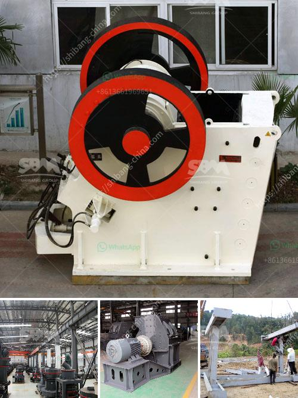

<h3>limestone crushing processing for the manufacturer</h3>
Limestone is a sedimentary rock composed mostly of the mineral calcite and comprising about 15% of the Earth's sedimentary crust. It is a basic building block of the construction industry and a chief material from which aggregate, cement, lime, and building stone are made. 71% of all crushed stone produced in the U.S. is either limestone or dolomite. As a source for lime, it is used to make paper, plastics, glass, paint, steel, cement, carpets, used in water treatment and purification plants and in the processing of various foods and household items.

Limestone is extracted from the ground through a mining process where heavy machinery, such as drillers, bulldozers, and cranes, are utilized to extract the rocks from deep underground mines. Once the limestone is extracted from the mines, it is transported to a crusher to break down the rocks into smaller sizes. The crushed limestone is then passed through a vibrating screen to separate the sized stones into different grades.

The limestone crushing process involves several stages of crushing machines that can process the raw limestone into smaller sizes for further processing. Jaw crushers, gyratory crushers, and cone crushers are commonly used for primary crushing operations. Crushing can be done in one or two stages, depending on the size of the required product.

After crushing, the crushed limestone is screened and classified according to size and grade. The oversized limestone particles are returned to the cone crusher for further crushing, while the smaller particles are sent to the vibrating screen to separate different sizes. The screened limestone is then conveyed to different storage bins or stockpiles for further processing.

Limestone is a versatile and valuable resource that has a wide range of applications in various industries. The crushed limestone can be used as a base for roads, as aggregate in concrete and asphalt, as a filler and extender in paints and coatings, as a raw material for the production of lime and cement, and as a decorative stone for landscaping and architectural purposes.

In limestone processing plants, the crushing equipment plays a crucial role in the production process. The crushers used in these plants include jaw crushers, impact crushers, cone crushers and gyratory crushers. These crushers have different crushing mechanisms and capabilities, making them suitable for various crushing tasks.

The choice of crusher depends on the desired product size and the size distribution of the feed material. Different crushers also have different capacity ranges, which should be carefully considered to ensure efficient production. It is also important to select crushers that are durable and reliable, as they will be subjected to continuous heavy use in the limestone crushing process.

In conclusion, limestone crushing processing is a complex process that requires various types of crushing equipment. Limestone has a versatile range of applications and must be crushed and screened to meet the desired product specifications. As a leading manufacturer of crushing equipment, we provide high-quality machines and customized solutions for limestone processing plants. Contact us today to learn more about our limestone crushing processing equipment.
<h3>Contact us</h3><ul><li><strong>Whatsapp:&nbsp;<a href="https://wa.me/8613661969651">+8613661969651</a></strong></li><li><a href="https://swt.shibang-china.com/?git&amp;zhl&amp;limestone crushing processing for the manufacturer"><strong>Online Service(chat now)</strong></a></li></ul><h3>Related</h3><ul><li><a href='how to pulverized limestone crusher.md'>how to pulverized limestone crusher</a></li><li><a href='want to buy stone crusher in canada.md'>want to buy stone crusher in canada</a></li><li><a href='calcium carbonate processing plant price.md'>calcium carbonate processing plant price</a></li><li><a href='crusher for sale in pakistan.md'>crusher for sale in pakistan</a></li><li><a href='coal mining equipment in spain.md'>coal mining equipment in spain</a></li></ul>