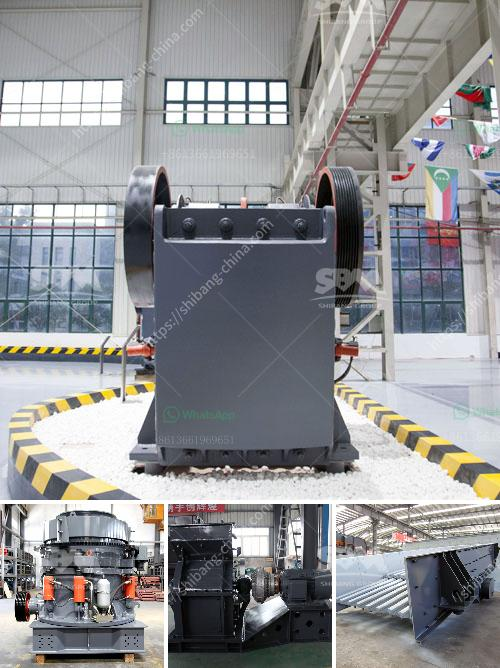

<h3>limestone crushing screening plant sandtrap</h3>
Limestone is one of the most abundant minerals found on the earth's surface and is widely used in various industries. In order to utilize this valuable resource efficiently, it is necessary to crush and screen the limestone to obtain the desired size and quality. This is where limestone crushing screening plant sandtraps come into play.

A limestone crushing screening plant sandtrap is a specialized facility used to crush and screen limestone into different sizes for various applications. The plant consists of a crusher, a screen, and a sand washing machine. The crusher breaks the limestone into smaller pieces, while the screen separates the crushed limestone according to size.

The sand washing machine removes impurities such as clay and dust from the crushed limestone, making it suitable for different applications. These machines work together seamlessly to enhance efficiency and productivity in the limestone crushing and screening process.

One of the key benefits of using a limestone crushing screening plant sandtrap is the ability to customize the size and quality of the crushed limestone. This is important because different industries have different requirements. For example, the construction industry may require larger-sized limestone for road construction, while the agricultural industry may need smaller-sized limestone for soil amendment.

In addition to customization, these plants also offer increased efficiency and productivity. The automated nature of the machines allows for continuous operation, reducing downtime and increasing output. The sand washing machine further enhances productivity by ensuring the crushed limestone is clean and ready for use.

Furthermore, a limestone crushing screening plant sandtrap can also contribute to environmental sustainability. The facility utilizes advanced dust suppression and noise reduction technologies to minimize the impact on the surrounding environment. Additionally, the use of sand traps prevents any potential pollution from entering nearby water bodies.

In conclusion, a limestone crushing screening plant sandtrap is a valuable tool for efficiently utilizing limestone resources. With the ability to customize the size and quality of crushed limestone, these plants cater to various industries' requirements. Moreover, their automated operation, increased efficiency, and productivity contribute to cost savings and environmental sustainability. By investing in a limestone crushing screening plant sandtrap, industries can ensure that this abundant mineral is used effectively and sustainably.
<h3>Contact us</h3><ul><li><strong>Whatsapp:&nbsp;<a href="https://wa.me/8613661969651">+8613661969651</a></strong></li><li><a href="https://swt.shibang-china.com/?git&amp;zhl&amp;limestone crushing screening plant sandtrap"><strong>Online Service(chat now)</strong></a></li></ul><h3>Related</h3><ul><li><a href='mobile crushing price uk.md'>mobile crushing price uk</a></li><li><a href='mobile gypsum crusher.md'>mobile gypsum crusher</a></li><li><a href='cost of grinding machines.md'>cost of grinding machines</a></li><li><a href='jaw crusher baxter.md'>jaw crusher baxter</a></li><li><a href='how does a quarry operate complete crushing palnt.md'>how does a quarry operate complete crushing palnt</a></li></ul>