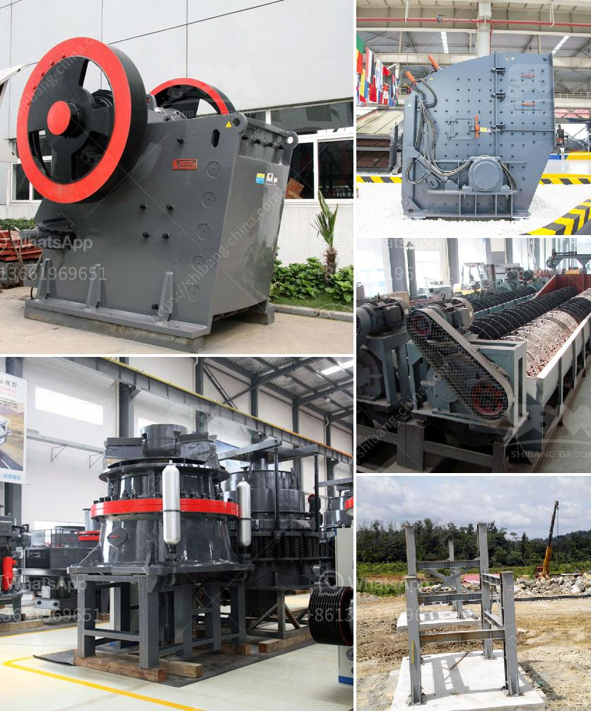

<h3>limestone grinding systems</h3>
Limestone is a versatile rock that finds wide application across various industries due to its diverse range of properties. For instance, in the construction industry, limestone is used as a building material, aggregates, and in the production of cement. In agriculture, it is used to improve soil quality, while in manufacturing, it serves as a raw material for the production of lime, paper, glass, and many other products.

To make the most of this valuable rock, limestone grinding systems are employed in various industries to finely grind limestone into various sizes and desired textures. These grinding systems are designed to enhance the efficiency of limestone processing and produce high-quality limestone powder.

One common limestone grinding system involves the use of a ball mill. A ball mill is a type of grinder used to grind materials into extremely fine powder for use in mineral dressing processes, paints, pyrotechnics, ceramics, and selective laser sintering. This grinding system utilizes a rotating cylindrical drum filled with steel balls to grind the limestone to the desired fineness. The resulting ground limestone powder can then be used in various applications.

Another approach to limestone grinding is through the use of an impact crusher. This system utilizes high-speed rotating hammers to crush limestone into smaller particles. The crushed limestone is then further ground to the desired size and texture using a variety of equipment such as a hammer mill, cage mill, or impact mill.

Irrespective of the limestone grinding system used, the key to efficient and effective limestone grinding lies in ensuring the proper hardness and particle size of the limestone feed. This can be achieved through rigorous quality control measures during the quarrying and processing stages. By closely monitoring the limestone characteristics, such as chemical composition and physical properties, and implementing suitable grinding parameters, the desired limestone powder can be consistently produced.

In conclusion, limestone grinding systems play a crucial role in various industries that rely on limestone as a raw material. By employing robust grinding systems, industries can maximize their limestone resources, improve product quality, and enhance process efficiency. Whether it is through ball mills or impact crushers, a well-designed limestone grinding system can effectively transform limestone into high-quality powder to serve numerous industrial applications.
<h3>Contact us</h3><ul><li><strong>Whatsapp:&nbsp;<a href="https://wa.me/8613661969651">+8613661969651</a></strong></li><li><a href="https://swt.shibang-china.com/?git&amp;zhl&amp;limestone grinding systems"><strong>Online Service(chat now)</strong></a></li></ul><h3>Related</h3><ul><li><a href='difference between raymond mill and vertical roller mill.md'>difference between raymond mill and vertical roller mill</a></li><li><a href='dry process of manufacturing calcium phosphate.md'>dry process of manufacturing calcium phosphate</a></li><li><a href='gypsum production line in spain for sale.md'>gypsum production line in spain for sale</a></li><li><a href='double roller crusher supplier.md'>double roller crusher supplier</a></li><li><a href='sand stone factory equipment.md'>sand stone factory equipment</a></li></ul>