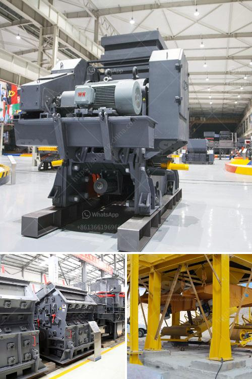

<h3>limestone hammer mill process</h3>
Limestone is an essential mineral commonly used in construction, agriculture, and various industrial applications. With the ever-increasing demand for limestone, it is essential to process the raw materials efficiently. One of the most effective equipment for processing limestone is the hammer mill.

The hammer mill is primarily used to crush the raw materials into smaller particles before they can be further processed. This process not only reduces the size of the limestone but also creates a more uniform particle size, promoting better mixing and combustion during subsequent processes.

The limestone hammer mill operates on the principle of impact crushing, where the hammer is used to strike the limestone and propel it against the crushing chamber's inner wall. The high-speed rotary hammer impacts the limestone, shattering it into smaller particles. These particles then pass through a series of screens, which determine the desired particle size.

The versatility of the limestone hammer mill is another advantage. It can effectively process both wet and dry materials, making it suitable for various applications. Whether it is grinding limestone for cement production or crushing it into finer particles for agricultural purposes, the hammer mill proves its efficiency time and again.

In addition to its versatility, the maintenance and operation of the limestone hammer mill are relatively straightforward. Regular inspection and cleaning of the hammers and screens ensure optimal performance and prevent clogging or wear. With appropriate care, the hammer mill can provide years of reliable service.

In conclusion, the limestone hammer mill process is an essential step in the limestone processing chain. It offers numerous advantages, including efficient size reduction, improved mixing, and combustion, and versatility in processing wet and dry materials. By incorporating a limestone hammer mill into their operations, industries can significantly enhance the quality and efficiency of their limestone processing.
<h3>Contact us</h3><ul><li><strong>Whatsapp:&nbsp;<a href="https://wa.me/8613661969651">+8613661969651</a></strong></li><li><a href="https://swt.shibang-china.com/?git&amp;zhl&amp;limestone hammer mill process"><strong>Online Service(chat now)</strong></a></li></ul><h3>Related</h3><ul><li><a href='products lm vertical grinding mills.md'>products lm vertical grinding mills</a></li><li><a href='italia crusher machine.md'>italia crusher machine</a></li><li><a href='quarry crusher equipment for sale brisbane.md'>quarry crusher equipment for sale brisbane</a></li><li><a href='cost of a stone crusher.md'>cost of a stone crusher</a></li><li><a href='sand crushing machine.md'>sand crushing machine</a></li></ul>