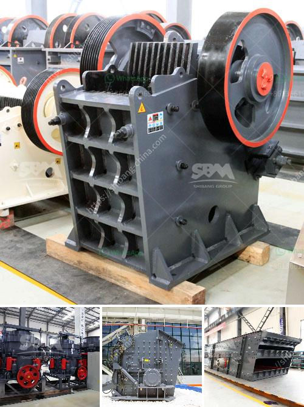

<h3>limestone impact mill price</h3>
When it comes to grinding and crushing materials, limestone is considered one of the most versatile and widely used. With its abundance and versatility, limestone has become a crucial component in various industries, including construction, agriculture, and manufacturing. To achieve the desired particle size and consistency, limestone often requires processing through impact mills.

An impact mill, also known as a hammer mill, is a machine used to crush and grind limestone into small particles. It works by repeatedly striking the material with high-speed rotating hammers until it is reduced to the desired size. This process allows for efficient and effective grinding, making impact mills a popular choice for limestone processing.

The price of an impact mill can vary depending on various factors, including the size, capacity, and specifications of the machine. However, a range of prices is available that can suit different budgets and requirements. In general, impact mills for limestone processing are considered cost-effective compared to other crushing and grinding solutions.

The affordability of limestone impact mills makes them an attractive option for businesses looking to optimize their production processes. These mills not only offer reliable performance but also help reduce maintenance costs and downtime. Their durable construction ensures long-term usability, minimizing the need for frequent replacements.

Furthermore, limestone impact mills can be tailored to specific requirements, allowing for versatile applications. The adjustable settings of the mill enable operators to control the output size, ensuring the desired particle size distribution. This flexibility makes impact mills suitable for various industries and applications, including cement production, chemical manufacturing, and agriculture.

Investing in a limestone impact mill is a wise choice for businesses that rely on limestone processing. From cost-effectiveness to reliability and versatility, these mills offer numerous advantages that can enhance production efficiency and overall profitability.

In conclusion, the price of a limestone impact mill can vary depending on the machine's size and specifications. However, they are generally considered a cost-effective solution for crushing and grinding limestone. With their reliable performance, durability, and versatility, impact mills offer businesses an efficient way to process limestone and achieve the desired particle size. By investing in an impact mill, companies can optimize their production processes and increase their overall profitability.
<h3>Contact us</h3><ul><li><strong>Whatsapp:&nbsp;<a href="https://wa.me/8613661969651">+8613661969651</a></strong></li><li><a href="https://swt.shibang-china.com/?git&amp;zhl&amp;limestone impact mill price"><strong>Online Service(chat now)</strong></a></li></ul><h3>Related</h3><ul><li><a href='cconveyor belts class.md'>cconveyor belts class</a></li><li><a href='ball mill size.md'>ball mill size</a></li><li><a href='cost of grinding machines.md'>cost of grinding machines</a></li><li><a href='germany standard pyrophyllite powder grinding mill.md'>germany standard pyrophyllite powder grinding mill</a></li><li><a href='gypsum powder production business plan.md'>gypsum powder production business plan</a></li></ul>