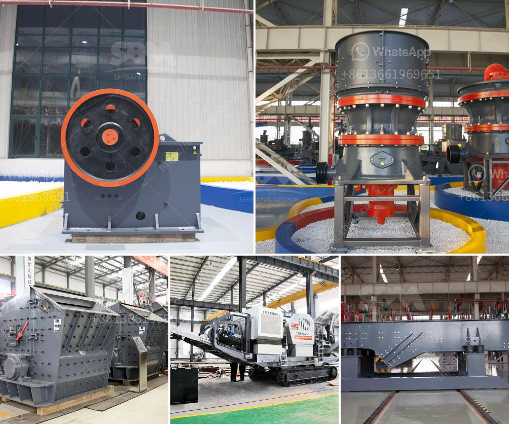

<h3>limestone jaw crushers</h3>
Limestone is one of the most common types of ore found underground, making it a popular choice for constructors worldwide. As the name suggests, limestone jaw crushers are used for crushing large chunks of rock to a manageable size. These crushers are highly productive and are widely utilized in the construction industry.

Limestone jaw crushers are used extensively throughout the aggregate and mineral processing industry. Crushing is a vital process that involves the interaction between a material and machinery to reduce particle size to a manageable level. Jaw crushers are known for their reliability and durability, making them the go-to choice for processing limestone.

One of the primary advantages of limestone jaw crushers is that they are versatile and can handle various types of materials. Whether crushed limestone, sandstone, granite, or any other type of rock, these crushers can handle it with ease. Limestone jaw crushers have a high crushing ratio and stable performance, ensuring consistent output size and making them excellent crushers for limestone crushing.

Another advantage of limestone jaw crushers is their low operating costs. Compared to other types of crushers, jaw crushers require less maintenance and have a longer lifespan. This means less downtime for repairs and lower operational costs overall. Additionally, these crushers are energy-efficient, reducing the amount of electricity needed to crush limestone, further saving on operational expenses.

One of the standout features of limestone jaw crushers is their reduced noise levels. Thanks to advanced technology and innovative design, noise is minimized during the crushing process. This is particularly beneficial in urban areas where noise pollution is a concern. Limestone jaw crushers enable construction sites to operate without disrupting the surrounding environment, making them an environmentally-friendly option.

Safety is a top priority in any construction site, and limestone jaw crushers excel in this aspect. These crushers are equipped with advanced safety features such as a toggle plate, which prevents oversize materials from entering the crushing chamber. This ensures the safety of the operator and minimizes the risk of accidents. Additionally, limestone jaw crushers have a sturdy construction that can withstand heavy-duty operations, making them reliable and safe to use.

The 300-500 words jaw crushers are available in various sizes, allowing operators to choose the most suitable model for their specific needs. Whether it's a small limestone quarry or a large-scale mineral processing plant, jaw crushers can be used in both stationary and mobile applications. This flexibility allows for easy integration into existing crushing circuits or the creation of standalone crushing plants.

In conclusion, limestone jaw crushers are an excellent choice for any construction site. With their versatility, low operating costs, reduced noise levels, and high safety standards, these crushers are a game-changer in the industry. Whether it's for breaking down large chunks of rock or processing limestone into different sizes, jaw crushers are a cost-effective and efficient solution. Their reliability and durability ensure a long lifespan, allowing operators to get the most out of their investment. So, if you're in need of efficient and reliable crushing equipment for limestone, look no further than limestone jaw crushers.
<h3>Contact us</h3><ul><li><strong>Whatsapp:&nbsp;<a href="https://wa.me/8613661969651">+8613661969651</a></strong></li><li><a href="https://swt.shibang-china.com/?git&amp;zhl&amp;limestone jaw crushers"><strong>Online Service(chat now)</strong></a></li></ul><h3>Related</h3><ul><li><a href='barite mill saltillo.md'>barite mill saltillo</a></li><li><a href='sand wash plant 50tph.md'>sand wash plant 50tph</a></li><li><a href='mini stone crushers for small scale mining.md'>mini stone crushers for small scale mining</a></li><li><a href='rubber latex processing ppt.md'>rubber latex processing ppt</a></li><li><a href='construction hammer mill.md'>construction hammer mill</a></li></ul>