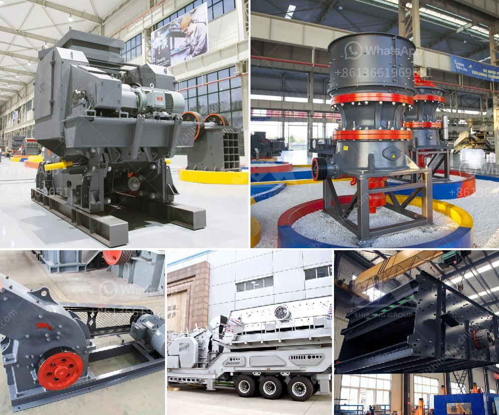

<h3>limestone making size</h3>
Limestone, a versatile sedimentary rock, has been used for various purposes throughout history. From construction to agriculture, this rock continues to play a vital role in our everyday lives. One of the most critical aspects of limestone is the process of making various sizes. In this article, we will explore the process of limestone making, the importance of size, and its diverse applications.

Limestone is primarily composed of calcium carbonate, with small amounts of various other minerals. Its formation starts with the accumulation of shells, coral, algae, and other organic debris over millions of years. Through pressure and heat, these sediments undergo a transformation, resulting in the formation of limestone.

Once the limestone has been formed, it can be quarried and processed into different sizes based on its specific application. The process of making limestone sizes involves several steps, including crushing, screening, and washing.

The first step in the process is crushing. Large limestone rocks are blasted from quarries and then crushed into smaller pieces using heavy machinery, such as jaw crushers or cone crushers. Crushing the limestone reduces it to a uniform size, making it easier to handle and transport.

After the initial crushing, the limestone undergoes screening to separate it into different sizes. This process is crucial as different applications require specific sizes of limestone. The screening process involves passing the crushed limestone through vibrating screens, which sort the material into different grades based on their size.

Once the limestone has been screened, it may go through further processing, such as washing. Washing the limestone helps remove impurities and ensures a cleaner product. This is especially important for applications that require high-quality limestone, such as concrete production or agricultural uses.

Now that we understand the limestone making process, let's explore the importance of size. Limestone is available in various sizes, ranging from small granules to larger rocks. The size of limestone is crucial in determining its applications and effectiveness.

Finer sizes of limestone, such as granules or dust, are commonly used in agriculture. The small particle size allows for better soil penetration and interaction with plant roots. Farmers apply limestone to their fields to neutralize soil acidity and improve nutrient availability, ultimately enhancing crop yields.

Coarser sizes of limestone, on the other hand, are often used in construction. Larger rocks or gravel-like sizes are commonly used as a base material for roads, driveways, or building foundations. Their strength and stability make them ideal for supporting heavy structures.

In addition to agriculture and construction, limestone finds applications in various industries. It is a key ingredient in cement production, where finely ground limestone is combined with other materials to create concrete. Limestone is also used in the production of lime, a critical component in steelmaking, paper manufacturing, and water treatment.

In conclusion, the process of making limestone sizes involves crushing, screening, and washing to ensure a consistent and high-quality product. The size of limestone plays a crucial role in its diverse applications, ranging from agriculture to construction and industrial uses. Understanding the limestone making process and its importance in creating different sizes allows us to appreciate the versatile nature of this timeless sedimentary rock.
<h3>Contact us</h3><ul><li><strong>Whatsapp:&nbsp;<a href="https://wa.me/8613661969651">+8613661969651</a></strong></li><li><a href="https://swt.shibang-china.com/?git&amp;zhl&amp;limestone making size"><strong>Online Service(chat now)</strong></a></li></ul><h3>Related</h3><ul><li><a href='hammer mills for limestone.md'>hammer mills for limestone</a></li><li><a href='prices crusher prices gypsum crusher prices.md'>prices crusher prices gypsum crusher prices</a></li><li><a href='crusher manufacturers in saudi.md'>crusher manufacturers in saudi</a></li><li><a href='gravimetric centrifugal gold concentrator.md'>gravimetric centrifugal gold concentrator</a></li><li><a href='nigeria raymond mill.md'>nigeria raymond mill</a></li></ul>