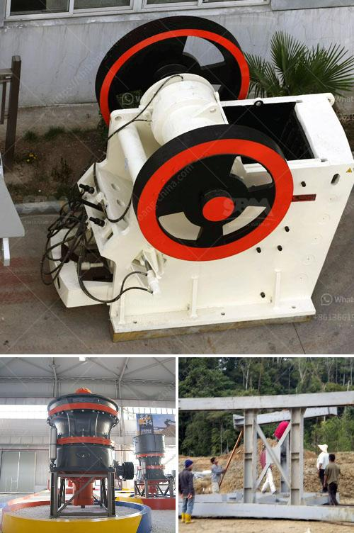

<h3>limestone manufacturing process</h3>
Limestone is a sedimentary rock formed from the accumulation of calcium carbonate over time. It is a valuable natural resource that exhibits numerous applications and can be used for both commercial and residential purposes. Understanding the limestone manufacturing process helps us appreciate the diverse range of products that can be produced from this versatile stone.

The process of manufacturing limestone involves several steps, starting from the extraction of raw materials from the quarry. This involves blasting the rocks, which loosens them from their natural layer. Once the limestone is loosened, it is then loaded into dump trucks for transportation to the crushing and screening plant, where it is crushed to various sizes suitable for further processing.

The first step in the limestone manufacturing process is crushing. Large rocks are reduced to smaller ones utilizing jaw crushers. This process ensures the limestone is of the required size, which can be utilized in various applications such as building materials, road construction, and agriculture.

After the limestone is crushed, it is then subjected to a secondary crushing stage. This further breaks down the material, resulting in a finer product that can be used in the production of cement or lime. The crushed limestone is then mixed with other substances, such as clay or shale, to create a mixture known as raw meal.

The next step in the limestone manufacturing process is the kiln phase, where the raw meal is subjected to intense heat. In this high-temperature environment, the raw meal undergoes a chemical reaction known as calcination. During this process, carbon dioxide is released from the limestone, changing it into calcium oxide, or quicklime. The calcination process not only removes impurities but also increases the calcium content, making the limestone suitable for various applications that require high-quality calcium compounds.

Once the raw meal has been calcined, it is then cooled and ground to produce a fine powder known as cement. This powder can be mixed with water to create concrete, which is widely used in the construction industry. Alternatively, the powdered limestone can be used to create lime, a versatile chemical compound that has numerous applications such as soil stabilization, water purification, and the production of glass and steel.

Limestone manufacturing offers a sustainable and environmentally friendly process. The use of limestone can reduce pollution and energy consumption. As a precursor to cement production, limestone absorbs carbon dioxide during the calcination process, thus reducing greenhouse gas emissions. Moreover, using limestone as a building material can enhance energy efficiency in buildings due to its insulating properties.

In conclusion, the limestone manufacturing process involves several stages, starting from the extraction and crushing of raw materials, followed by the calcination, cooling, and grinding phases. These steps transform the limestone into various products such as cement, lime, and crushed stone, which find applications in construction, agriculture, and industry. The sustainable nature of limestone manufacturing makes it a valuable resource for creating a greener future.
<h3>Contact us</h3><ul><li><strong>Whatsapp:&nbsp;<a href="https://wa.me/8613661969651">+8613661969651</a></strong></li><li><a href="https://swt.shibang-china.com/?git&amp;zhl&amp;limestone manufacturing process"><strong>Online Service(chat now)</strong></a></li></ul><h3>Related</h3><ul><li><a href='crusher plant manufacturers in south africa.md'>crusher plant manufacturers in south africa</a></li><li><a href='crusher supplier in saudi arabia.md'>crusher supplier in saudi arabia</a></li><li><a href='hammer mill for clay.md'>hammer mill for clay</a></li><li><a href='quarry crusher equipment for sale brisbane.md'>quarry crusher equipment for sale brisbane</a></li><li><a href='copper ore conveying system.md'>copper ore conveying system</a></li></ul>