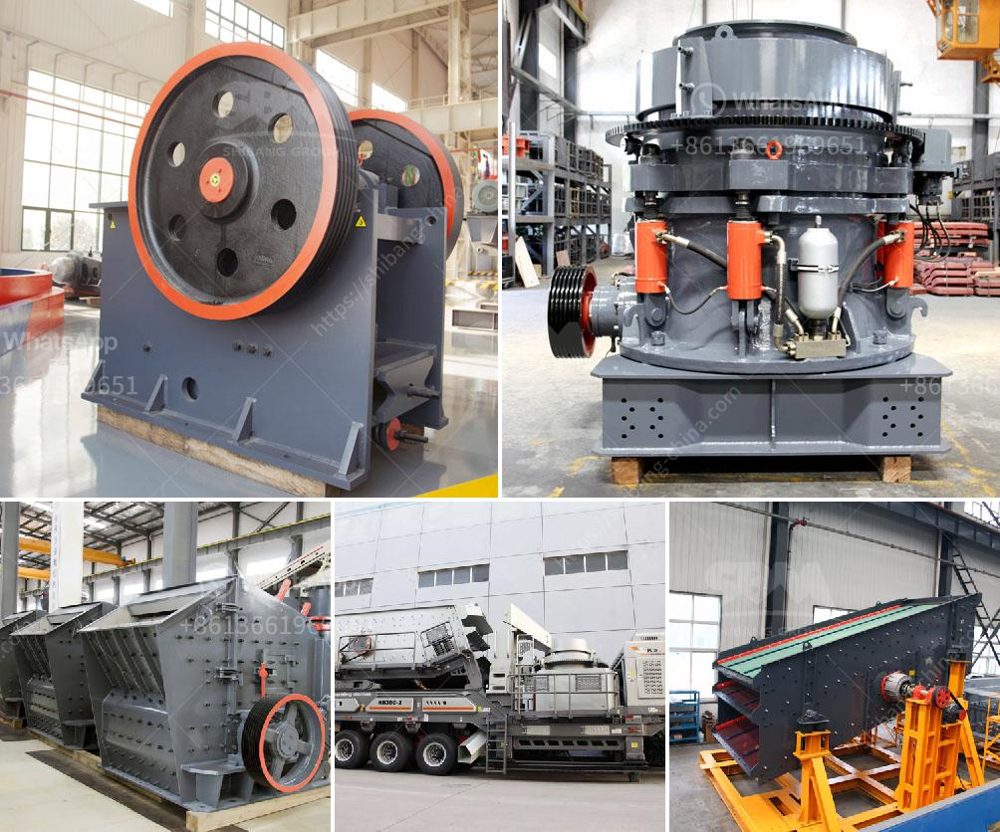

<h3>limestone price in pakistan</h3>
Limestone is a sedimentary rock composed mainly of calcium carbonate (CaCO3). It is found in abundance in Pakistan and is widely used as a raw material in construction and manufacturing industries. 

Limestone deposits in Pakistan are abundant, with commercial quantities found in various regions, including Khyber Pakhtunkhwa, Punjab, Balochistan, and Sindh. The country has a vast resource base of limestone, which is estimated to be around 330 million tons.

The price of limestone in Pakistan varies depending on the quality and quantity of the mineral. High-quality limestone, suitable for use in various industries, including cement manufacturing, agriculture, and sugar production, is in high demand, therefore commanding a higher price.

Currently, the average price of limestone in Pakistan ranges from Rs. 50 to Rs. 150 per ton, depending on the quality, grading, and quantity required. It is worth mentioning that the price can go up significantly if the limestone is being supplied to remote areas or if transportation costs are high.

For construction purposes, limestone is essential in the production of cement, as it is the main component used in its manufacturing process. Thus, the demand for limestone by cement manufacturers significantly influences its price. Other industries, such as glass manufacturing, agriculture, and sugar production, also contribute to the demand and thus impact the pricing.

The cost of limestone in Pakistan is also influenced by several other factors, including mining and processing costs, government taxes and regulations, transport costs, and market dynamics. However, despite these variables, limestone remains a relatively affordable building material in Pakistan.

In conclusion, limestone is a widely available and versatile mineral in Pakistan. Its demand and subsequent price vary depending on factors such as quality, grading, quantity, and market dynamics. However, it remains a vital resource for various industries, contributing to the economic development of the country while providing an affordable building material for construction purposes.
<h3>Contact us</h3><ul><li><strong>Whatsapp:&nbsp;<a href="https://wa.me/8613661969651">+8613661969651</a></strong></li><li><a href="https://swt.shibang-china.com/?git&amp;zhl&amp;limestone price in pakistan"><strong>Online Service(chat now)</strong></a></li></ul><h3>Related</h3><ul><li><a href='mica processing plant per ton.md'>mica processing plant per ton</a></li><li><a href='vibrating feeders in iron ore pelletization.md'>vibrating feeders in iron ore pelletization</a></li><li><a href='quartz plant in india.md'>quartz plant in india</a></li><li><a href='gold stamp mill manufacturer in china.md'>gold stamp mill manufacturer in china</a></li><li><a href='stone crushing plant keesara.md'>stone crushing plant keesara</a></li></ul>