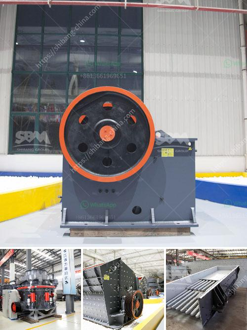

<h3>limestone processing flow sheet</h3>
Limestone is a common sedimentary rock, primarily composed of the mineral calcite (CaCO3). Limestone processing involves several steps, such as crushing, screening, grinding, and calcium carbonate precipitation. In this article, we will discuss the limestone processing flow sheet, starting from raw limestone mined from the quarry to the final product.

The first step in the limestone processing flow sheet is primary crushing. This is usually accomplished by mechanical crushers that reduce the size of the rock to about 10 cm. The crushed rock is then transported to a screening operation where it is divided into different sizes, depending on the end-use application.

After screening, the limestone is further processed by grinding. This is done in large rotary kilns where the limestone is heated to a high temperature, causing it to undergo a chemical reaction. During this process, the limestone loses carbon dioxide and transforms into calcium oxide (CaO), also known as quicklime.

The calcium oxide obtained from the kilns is then hydrated to produce calcium hydroxide (Ca(OH)2). This process is known as slaking. Hydrated lime is used in a variety of industries, including construction, agriculture, and water treatment.

To produce high-quality calcium carbonate, the calcium hydroxide is further processed. It is first screened to remove any impurities and then goes through a carbonation process. In carbonation, carbon dioxide gas is bubbled through the calcium hydroxide solution, causing it to react and precipitate calcium carbonate.

The calcium carbonate is then separated from the solution through a filtration process. The resulting calcium carbonate is dried and further processed into various forms, such as powder or granules, depending on the application.

The limestone processing flow sheet described above provides a simplified representation of the limestone processing industry. It highlights the important steps, including crushing, screening, grinding, calcium carbonate precipitation, and separation.

While the flow sheet provides a general overview of the process, it is important to note that each limestone processing operation may have its specific variations and considerations. Factors such as the quality of the limestone, the desired end product, and the available equipment may influence the processing steps and parameters.

In conclusion, limestone processing involves a series of steps from crushing and screening to grinding and precipitation. The flow sheet highlights the key steps involved in transforming raw limestone into useful products, such as calcium oxide, hydrated lime, and calcium carbonate.

The limestone processing industry plays a vital role in various sectors, including construction, agriculture, and water treatment. Understanding the limestone processing flow sheet is essential for efficient and sustainable operation, ensuring the production of high-quality limestone products that meet the industry's needs.
<h3>Contact us</h3><ul><li><strong>Whatsapp:&nbsp;<a href="https://wa.me/8613661969651">+8613661969651</a></strong></li><li><a href="https://swt.shibang-china.com/?git&amp;zhl&amp;limestone processing flow sheet"><strong>Online Service(chat now)</strong></a></li></ul><h3>Related</h3><ul><li><a href='jaw crusher seller in pakistan.md'>jaw crusher seller in pakistan</a></li><li><a href='granite crusher south africa.md'>granite crusher south africa</a></li><li><a href='how to wash sand for construction.md'>how to wash sand for construction</a></li><li><a href='stone crusher sale lease.md'>stone crusher sale lease</a></li><li><a href='gold milling machine for small scale production germany.md'>gold milling machine for small scale production germany</a></li></ul>