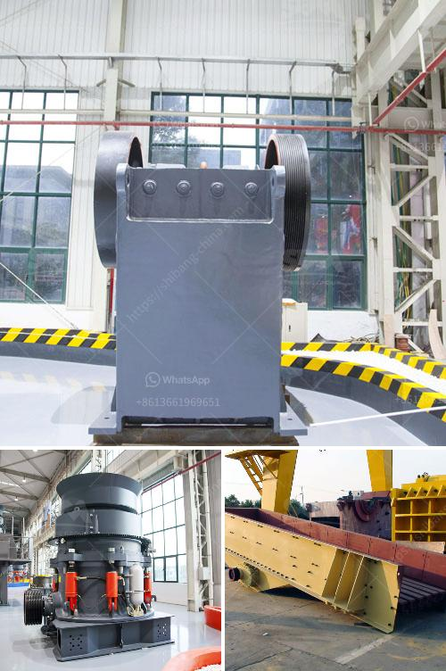

<h3>limestone processing plant in benin</h3>
Limestone processing plant in Benin is a high-profile project for the country and is a significant investment in its economic development. Located in Savé-Kétou Department, the factory has a capacity to process 200 tons of limestone per day, producing high-quality calcium carbonate as a final product.

Limestone is a sedimentary rock composed primarily of calcium carbonate, which is widely used in various industries such as construction, agriculture, and manufacturing. It is a crucial raw material in the production of cement, fertilizers, and lime, among other industrial applications. The establishment of the limestone processing plant in Benin is aimed at meeting the growing demand for limestone products in the region while creating employment opportunities for the local population.

The limestone processing plant in Benin consists of two main components: a crushing plant and grinding plant. Each process requires significant energy input and several types of machinery. The crushing plant receives limestone from mines and reduces it to small manageable sizes. The primary crusher, a jaw crusher, crushes the limestone to a size of about 125mm. The crushed limestone is then transported to the grinding plant for further processing.

At the grinding plant, limestone is mixed with other materials such as clay, shale, and iron ore to create a mixture known as raw meal. The raw meal is then homogenized and ground into a fine powder in a ball mill. The grinding process ensures the limestone particles are of consistent size and that all the components are well mixed.

Once the raw meal is obtained, it is fed into a preheater tower and then into a rotary kiln at high temperatures of around 1450 degrees Celsius. In the rotary kiln, the raw meal undergoes a chemical reaction called calcination, which transforms it into a material known as clinker. The clinker is then cooled and ground into a fine powder, known as cement, which is the final product of the limestone processing plant.

The limestone processing plant in Benin is equipped with state-of-the-art technology and operates efficiently, meeting high-quality standards. It employs skilled technicians and engineers who oversee the entire process, from raw material intake to final product packaging. The plant adheres to strict environmental regulations, ensuring minimal impact on the surrounding ecosystem.

The establishment of the limestone processing plant in Benin has significant economic benefits for the country. It provides employment opportunities, directly supporting the livelihoods of local communities. Additionally, it reduces the need for imports of limestone products, contributing to the country's self-sufficiency and reducing dependence on foreign markets.

Furthermore, the limestone processing plant contributes to industrial development in the region. It supplies limestone products to various industries, enabling them to expand their operations and create more job opportunities. The availability of high-quality calcium carbonate enhances local manufacturing capabilities, attracting investments and fostering economic growth.

In conclusion, the limestone processing plant in Benin is a project of great importance for the country's economic development. Its efficient operation, adherence to environmental regulations, and provision of high-quality limestone products contribute to both local and regional growth. With the establishment of such plants, Benin is on the path to becoming self-sufficient and economically prosperous.
<h3>Contact us</h3><ul><li><strong>Whatsapp:&nbsp;<a href="https://wa.me/8613661969651">+8613661969651</a></strong></li><li><a href="https://swt.shibang-china.com/?git&amp;zhl&amp;limestone processing plant in benin"><strong>Online Service(chat now)</strong></a></li></ul><h3>Related</h3><ul><li><a href='top stone crusher companies in india.md'>top stone crusher companies in india</a></li><li><a href='cost of grizzly crusher.md'>cost of grizzly crusher</a></li><li><a href='talc raymond grinding mill.md'>talc raymond grinding mill</a></li><li><a href='stone hammer mill.md'>stone hammer mill</a></li><li><a href='used sweco screening equipment for sale.md'>used sweco screening equipment for sale</a></li></ul>