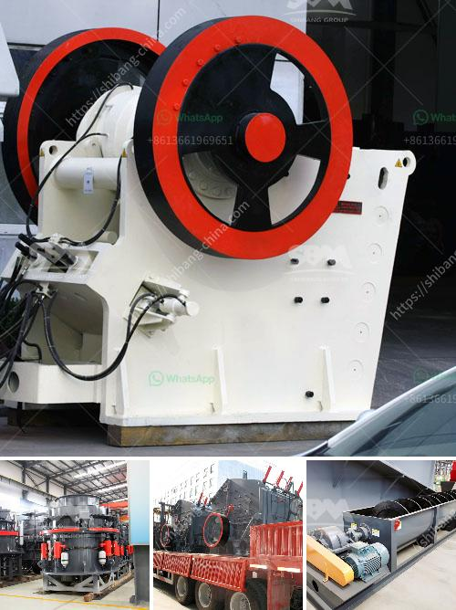

<h3>limestone washing and classifi ion</h3>
Limestone is a popular building material known for its durability and aesthetic appeal. However, over time, limestone surfaces can become dirty and stained due to environmental factors such as pollution, weathering, and natural wear and tear. This is where limestone washing and classification come into play.

Limestone washing is the process of cleaning the limestone surfaces to remove dirt, stains, and other impurities. It involves using specialized limestone cleaners and techniques to ensure the best possible results. The goal of limestone washing is to restore the natural beauty of the stone while preserving its structural integrity.

There are several methods used for limestone washing, including pressure washing, scrubbing, and chemical cleaning. Pressure washing involves using high-pressure water jets to remove dirt, algae, and moss from the limestone surface. Scrubbing, on the other hand, involves manually scrubbing the surface with a brush or scrubbing pad to remove stubborn stains. Chemical cleaning utilizes specific limestone cleaners and detergents to dissolve dirt and grime without damaging the stone.

After the washing process, limestone surfaces are often classified based on their appearance and quality. Classification helps in identifying the appropriate usage and maintenance requirements for the stone. The classification may take into account factors such as color variation, porosity, texture, and patterns. For example, some limestone may be classified as low-density, making it more susceptible to staining and erosion, while others may be classified as high-density and more resistant to wear and tear.

Proper limestone washing and classification are essential to maintain the longevity and aesthetics of limestone surfaces. Regular cleaning and maintenance ensure that the stone retains its natural beauty and structural integrity. It is recommended to consult with professionals experienced in limestone washing and classification to ensure the best possible care for your limestone surfaces.

In conclusion, limestone washing and classification are crucial processes to maintain the beauty and durability of limestone surfaces. Through proper cleaning techniques and classification, limestone can be restored to its original glory while ensuring its long-term sustainability. Regular maintenance and professional guidance are essential for preserving the beauty and longevity of limestone in various architectural and construction applications.
<h3>Contact us</h3><ul><li><strong>Whatsapp:&nbsp;<a href="https://wa.me/8613661969651">+8613661969651</a></strong></li><li><a href="https://swt.shibang-china.com/?git&amp;zhl&amp;limestone washing and classifi ion"><strong>Online Service(chat now)</strong></a></li></ul><h3>Related</h3><ul><li><a href='supplier of conveyor belt kenya.md'>supplier of conveyor belt kenya</a></li><li><a href='raymond mill production line.md'>raymond mill production line</a></li><li><a href='manufacture of conveyor belts in mexico.md'>manufacture of conveyor belts in mexico</a></li><li><a href='quartz stone machine in turkey.md'>quartz stone machine in turkey</a></li><li><a href='how to build a stone crusher.md'>how to build a stone crusher</a></li></ul>