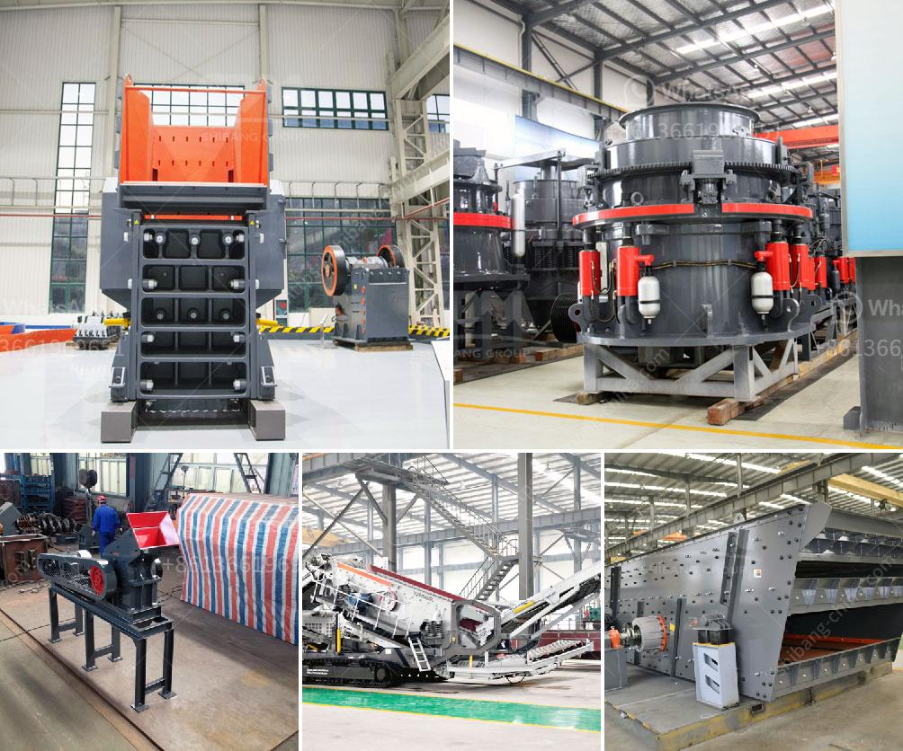

<h3>list mining equipments are used in granite quarries</h3>
Granite is a natural stone that is quarried in many countries around the world. Granite and other natural stones are often mined from large granite quarries. This article describes the various equipment used in mining granite.

Granite mining is a large industrial process which begins with exposing a granite deposit. Once the granite deposit is exposed, open-cast mining is the usual way to exploit the reserves. Granite mining is challenging and requires substantial investment and manpower to operate. The process starts by removing overburdened material which is then placed in a designated dump area. The granite deposit is then extracted using hydraulic drills and power cables to detach it from its natural state. 

The equipment used in granite mining mainly includes diamond wire saws, chainsaws, wire saw beads, and other accessories for extracting the granite. These tools are essential in the initial stages of the mining process. 

Diamond wire saws are one of the main tools used in granite quarries. These saws consist of a cutting wire with diamond beads attached to it. Diamond wire saws are highly efficient in cutting through hard surfaces like granite, allowing for precise and controlled extraction of the stone. The wire is driven using a pulley system and powered by an electric motor. Diamond wire saws can cut through granite at a very high speed, making them ideal for large-scale extraction.

Chainsaws are another commonly used tool in granite mining. These chainsaws are specially designed for cutting through hard materials like granite. They have advanced cutting teeth that can bite into the rock and create precise cuts. Chainsaws are often used in conjunction with diamond wire saws to achieve a more efficient and quick extraction process.

Wire saw beads are an important component of the diamond wire saws. These beads are made of synthetic diamonds that are sintered onto a metal wire. The diamonds provide the cutting edge while the wire provides the flexibility required for maneuvering around the granite deposit. The beads are spaced at specific intervals along the wire, ensuring a consistent cutting surface throughout the mining process.

In addition to the above-mentioned tools, other equipment used in granite quarries include excavators, loaders, bulldozers, and trucks for transporting the extracted granite. These heavy-duty machines are used to remove any remaining overburden, transport the extracted blocks, and perform other necessary tasks in the quarry.

In conclusion, granite mining requires a range of specialized equipment to ensure efficient and safe extraction of the stone. Diamond wire saws, chainsaws, wire saw beads, and other tools are essential in the process of mining granite. These tools allow for precise cutting and extraction of the granite, making it possible to extract large quantities of granite from the quarries. Furthermore, heavy-duty machinery such as excavators, loaders, and trucks are used to transport the granite blocks once extracted.
<h3>Contact us</h3><ul><li><strong>Whatsapp:&nbsp;<a href="https://wa.me/8613661969651">+8613661969651</a></strong></li><li><a href="https://swt.shibang-china.com/?git&amp;zhl&amp;list mining equipments are used in granite quarries"><strong>Online Service(chat now)</strong></a></li></ul><h3>Related</h3><ul><li><a href='project feasibility report on stone crusher.md'>project feasibility report on stone crusher</a></li><li><a href='alluvial gold mining equipment used for sale.md'>alluvial gold mining equipment used for sale</a></li><li><a href='crusher machine supplier.md'>crusher machine supplier</a></li><li><a href='crusher for sale in pakistan.md'>crusher for sale in pakistan</a></li><li><a href='top roller mills for sale.md'>top roller mills for sale</a></li></ul>