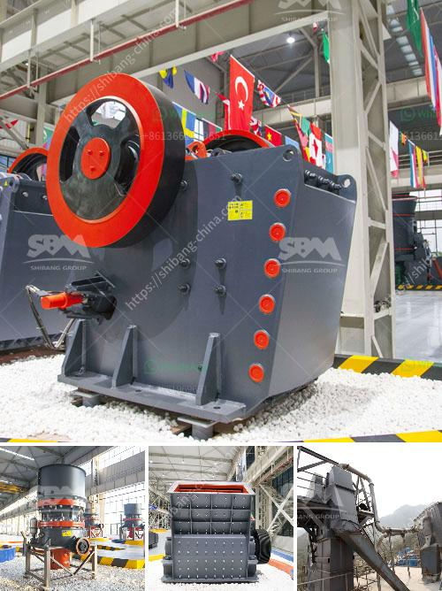

<h3>list of all the equipment for gold mining</h3>
The gold mining industry has witnessed significant technological advancements over the years. With the evolution of mining equipment, the sector has seen a tremendous increase in both productivity and efficiency. Today, there are various types of equipment used to extract gold from the earth's crust. Let's explore some of the essential machinery prevalent in modern gold mining operations.

1. Excavators: These heavy-duty machines are vital for digging and extracting gold-bearing ore. They are equipped with bucket attachments that aid in the excavation process.

2. Trommel: A trommel is a screening machine used to separate gold particles from gravel and debris. It consists of a rotating drum, which screens the material, allowing the smaller gold particles to pass through while discarding the unwanted materials.

3. Wash Plant: A wash plant is utilized to wash gold-bearing soil or gravel to separate the gold nuggets or flakes from the rest of the material. It uses water, jets, and screens to accomplish this task efficiently.

4. Shaker Table: Also known as a shaking table, this equipment utilizes water and vibration to separate gold particles from other materials. It relies on the density differences between the components to effectively extract gold.

5. Centrifugal Concentrator: A centrifugal concentrator utilizes centrifugal force to separate gold particles from the surrounding material. It works by spinning a bowl containing the material, which forces the heavier gold particles to settle at the bottom.

6. Dredges: Dredges are used to extract gold from underwater locations like rivers or streams. They consist of a suction hose or scoop attached to a floating platform that can be maneuvered along the waterbed.

7. Crushers and Mills: Once the gold-bearing ore is extracted, it needs to be crushed and ground into smaller particles for further processing. Crushers and mills are used for this purpose, breaking down the material into manageable sizes.

8. Flotation Equipment: Flotation is a method used to separate gold particles from other minerals or metals by using specific chemicals and air bubbles. Various types of flotation equipment, such as flotation cells and flotation columns, are employed in this process.

These are just a few of the equipment commonly used in gold mining operations. The selection of machinery depends on various factors, including the scale of the operation, the geology of the area, and the desired outcome. As technology continues to evolve, more advanced equipment is being developed to improve efficiency and maximize gold production in the mining industry.
<h3>Contact us</h3><ul><li><strong>Whatsapp:&nbsp;<a href="https://wa.me/8613661969651">+8613661969651</a></strong></li><li><a href="https://swt.shibang-china.com/?git&amp;zhl&amp;list of all the equipment for gold mining"><strong>Online Service(chat now)</strong></a></li></ul><h3>Related</h3><ul><li><a href='crushing sale rotary drum dryer cost.md'>crushing sale rotary drum dryer cost</a></li><li><a href='size of balls in ball mill.md'>size of balls in ball mill</a></li><li><a href='used quarry crusher for sale.md'>used quarry crusher for sale</a></li><li><a href='manganese washing equipment cost.md'>manganese washing equipment cost</a></li><li><a href='zambia mobile crusher.md'>zambia mobile crusher</a></li></ul>