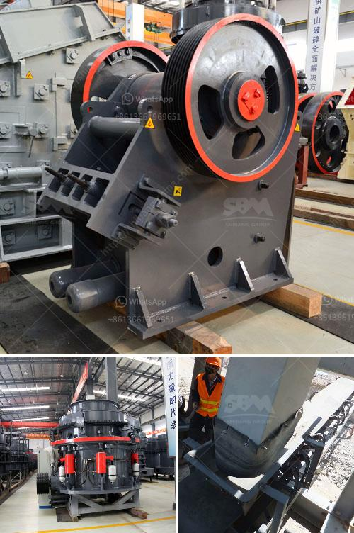

<h3>list of machinery for 3000 tonnes per hour crusher</h3>
A crusher is a machine designed to reduce large rocks into smaller rocks, gravel, or rock dust. With the rapid development of mining technology, the cone crusher can be divided into four types: compound cone crusher, spring cone crusher, hydraulic cone crusher, and gyratory crusher. A cone crusher breaks rock by squeezing the rock between an eccentrically gyrating spindle, which is covered by a wear-resistant mantle, and the enclosing concave hopper, covered by a manganese concave or a bowl liner. As rock enters the top of the cone crusher, it becomes wedged and squeezed between the mantle and the bowl liner or concave.

- Jaw crusher: This is a type of crusher that is widely used in the primary and secondary crushing processes. It is usually preferred for the crushing of large blocks of hard and abrasive materials.

- Gyratory crusher: This type of crusher consists of a concave surface and a conical head. It is commonly used for primary crushing of larger rocks.

- Impact crusher: This machinery is versatile and can break a variety of materials into smaller pieces. It is typically used for secondary crushing and can have a capacity of up to 1000 tonnes per hour.

- Cone crusher: Also known as a secondary crusher, this machinery is commonly used for crushing rocks into smaller sizes. It has a large feed opening that allows it to handle larger rocks and can achieve outputs of up to 2000 tonnes per hour.

- Vibrating screens: These are used to separate the crushed materials into different sizes. They can have multiple decks to classify the materials and are commonly used in the mining and recycling industries.

- Conveyors: These are used to transport the material from one process to another. They are essential for efficient operation and can have a capacity of up to 3000 tonnes per hour.

- Feeders: These are used to control the flow of material into the crusher. They ensure a constant and uniform feed, which maximizes the crusher's efficiency.

- Hoppers: These are storage containers that hold the material before it is fed into the crusher. They can be used to regulate the flow of material and prevent the crusher from being overloaded.

In conclusion, a crusher with a capacity of 3000 tonnes per hour requires a variety of machinery to ensure efficient operation. These machinery include jaw crushers, gyratory crushers, impact crushers, cone crushers, vibrating screens, conveyors, feeders, and hoppers. All these machines work together to break down and process large quantities of material into smaller, more manageable pieces.
<h3>Contact us</h3><ul><li><strong>Whatsapp:&nbsp;<a href="https://wa.me/8613661969651">+8613661969651</a></strong></li><li><a href="https://swt.shibang-china.com/?git&amp;zhl&amp;list of machinery for 3000 tonnes per hour crusher"><strong>Online Service(chat now)</strong></a></li></ul><h3>Related</h3><ul><li><a href='granite quarry companies in europe.md'>granite quarry companies in europe</a></li><li><a href='cement mill startup procedures.md'>cement mill startup procedures</a></li><li><a href='roller mill for onions.md'>roller mill for onions</a></li><li><a href='project feasibility report on stone crusher.md'>project feasibility report on stone crusher</a></li><li><a href='nigeria c125 jaw crusher.md'>nigeria c125 jaw crusher</a></li></ul>