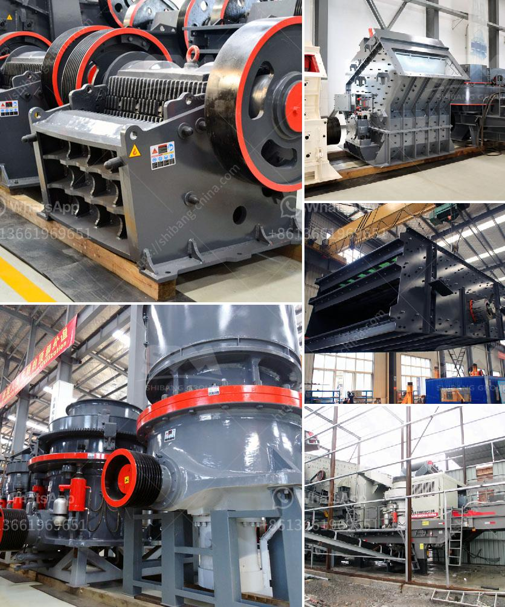

<h3>list of machinery used in cement plant</h3>
A cement plant is a facility that produces cement, the most essential material in the construction industry. It is necessary to invest in high-quality machinery to ensure product quality and efficiency.

To help you understand the machinery used in a cement plant, here is a list of equipment and their uses:

1. Crushers: Jaw crushers, impact crushers, and hammer crushers are used to break large clinker and raw materials into smaller particles. These machines help in reducing the size of the materials, making it easier to process them.

2. Preheater: The preheater system is responsible for heating raw materials before they enter the kiln. It consists of several stages, typically cyclones, where the materials are heated by the combustion gases. This process helps in increasing the efficiency of the kiln and reducing fuel usage.

3. Kiln: The kiln is the heart of a cement plant. It is a large rotating furnace where raw materials are heated at high temperatures to produce clinker. The kiln is lined with refractory bricks that withstand extreme heat. The clinker produced in the kiln is then ground with gypsum and other additives to form cement.

4. Cement mill: This equipment grinds clinker and other materials in the production of cement. It is capable of producing different types of cement, including ordinary Portland cement, pozzolana Portland cement, and slag Portland cement. This machinery significantly enhances the quality of the final product.

5. Cement silos: Cement silos are storage tanks for cement that is ready to be shipped or used in construction. They come in various sizes to accommodate different production capacities. The silos are equipped with aeration systems to prevent moisture and maintain the quality of the cement.

6. Packing and loading machinery: After the cement has been produced and ground, it needs to be packaged for distribution. Packing machines are used to fill cement bags accurately and efficiently. These machines can handle large quantities of cement and ensure the bags are properly sealed and labeled.

7. Dust collectors: Cement production involves the generation of dust and pollutants that can be harmful to the environment and human health. Dust collectors, such as bag filters and electrostatic precipitators, help in capturing and removing these particles from the air, ensuring a cleaner and safer working environment.

8. Compressors: Compressed air is necessary for operating various pneumatic tools and equipment in a cement plant. Compressors provide the required compressed air for processes such as conveying materials, operating valves, and powering tools.

9. Conveyors: Cement plants require a reliable and efficient conveyor system to transport materials throughout the production process. Belt conveyors, screw conveyors, and bucket elevators are commonly used to move materials such as crushed limestone, raw meal, and clinker.

Investing in high-quality machinery and equipment is crucial for a cement plant to achieve optimal production capacity, product quality, and efficiency. The mentioned machinery plays vital roles in different stages of the cement manufacturing process, ensuring that the final product is of the highest standard.

Having a clear understanding of the machinery used in a cement plant helps industry professionals make informed decisions when it comes to maintenance, repairs, and upgrades. By having reliable and efficient machinery, cement plants can ensure smooth operations, reduce downtime, and meet the demands of the construction industry.
<h3>Contact us</h3><ul><li><strong>Whatsapp:&nbsp;<a href="https://wa.me/8613661969651">+8613661969651</a></strong></li><li><a href="https://swt.shibang-china.com/?git&amp;zhl&amp;list of machinery used in cement plant"><strong>Online Service(chat now)</strong></a></li></ul><h3>Related</h3><ul><li><a href='iron jaw crusher with output of mm.md'>iron jaw crusher with output of mm</a></li><li><a href='crushing plants for sale.md'>crushing plants for sale</a></li><li><a href='quartz plant in india.md'>quartz plant in india</a></li><li><a href='stone crusher in pakistan.md'>stone crusher in pakistan</a></li><li><a href='gold crushing machine and price.md'>gold crushing machine and price</a></li></ul>