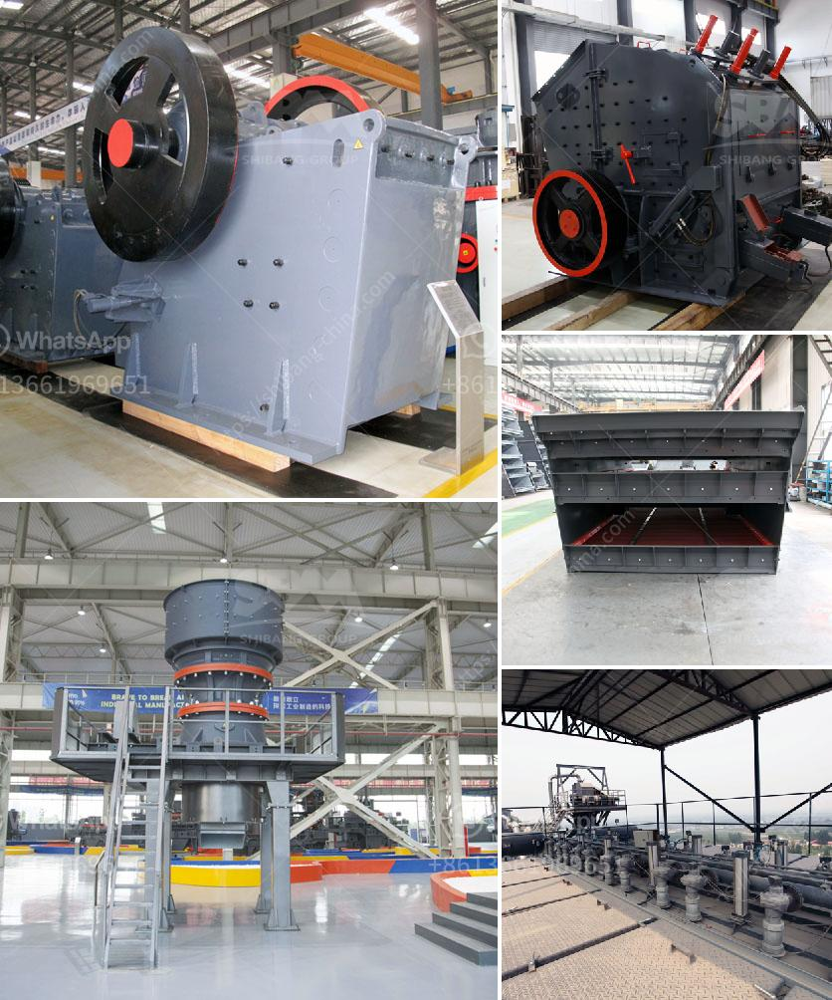

<h3>list of mineral processing plants in oman</h3>
Oman is known for its vast mineral resources and has been actively engaged in mining and mineral processing activities for several decades. The Sultanate has a rich reservoir of minerals like copper, gypsum, limestone, and marble, among others. To harness the potential of these resources, the country has established numerous mineral processing plants.

One of Oman's major mineral processing plants is the Sohar Industrial Minerals Company (SIMCO). Located in Sohar, this plant specializes in the production of various minerals, including limestone products, gypsum, and marble. SIMCO has state-of-the-art machinery and equipment to ensure high-quality production and offers a wide range of mineral products that cater to diverse industries.

Another prominent mineral processing plant in Oman is the Oman Chromite Company (OCC). With its strategic location in Sohar, OCC is a leading producer and exporter of chromite ore. It has advanced and efficient mining and processing facilities that adhere to international standards. OCC plays a significant role in the global chromite market, supplying high-quality chromite to various industries worldwide.

The Gulf Mining Group is another noteworthy player in Oman's mineral processing sector. It operates several mineral processing plants and quarries that produce a wide range of minerals, such as limestone, gypsum, quartz, and clay. With its expertise and infrastructure, the Gulf Mining Group ensures the sustainable extraction and processing of minerals while maintaining environmental balance.

In addition to these major players, Oman has several smaller mineral processing plants spread across the country that focus on specific minerals or cater to niche markets. These plants contribute to the overall development of Oman's mining sector and provide employment opportunities to the local workforce.

Oman's commitment to sustainable mining practices and the development of its mineral processing plants has positioned the country as a reliable supplier of minerals in the international market. With continuous investments in infrastructure and technology, the Sultanate aims to further enhance its mineral processing capabilities and explore new opportunities in the ever-expanding global mineral industry.
<h3>Contact us</h3><ul><li><strong>Whatsapp:&nbsp;<a href="https://wa.me/8613661969651">+8613661969651</a></strong></li><li><a href="https://swt.shibang-china.com/?git&amp;zhl&amp;list of mineral processing plants in oman"><strong>Online Service(chat now)</strong></a></li></ul><h3>Related</h3><ul><li><a href='advantages of hammer mill.md'>advantages of hammer mill</a></li><li><a href='calcium carbonate for ball mill.md'>calcium carbonate for ball mill</a></li><li><a href='want to buy stone crusher in canada.md'>want to buy stone crusher in canada</a></li><li><a href='calcium processing plant.md'>calcium processing plant</a></li><li><a href='vibrating feeder zenith.md'>vibrating feeder zenith</a></li></ul>