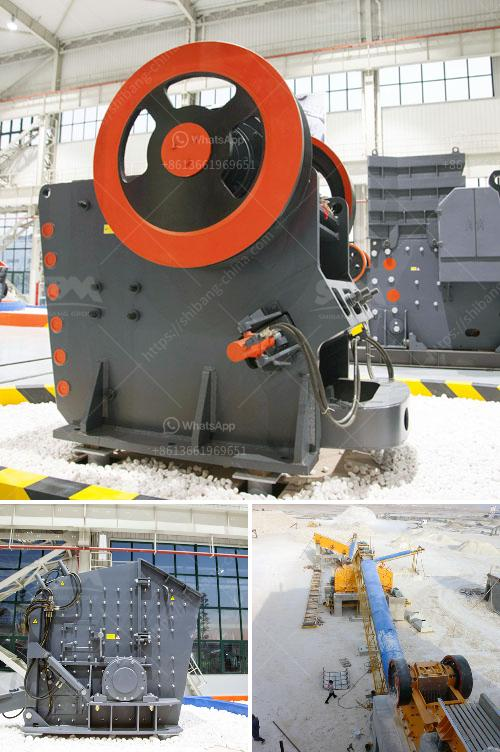

<h3>list of quarrying companies in the philippines</h3>
The Philippines is a developing country rich in natural resources, particularly minerals. As of 2021, the country had 44 operating mines and 206 exploration permits, mainly for metallic minerals such as copper, gold, and nickel. Quarrying, on the other hand, is focused on the extraction of nonmetallic minerals like limestone, marble, sand, gravel, and volcanic cinders.

Here is a list of some of the quarrying companies in the Philippines that contribute to the country's thriving mining industry:

1. Holcim Philippines Inc. - Holcim is one of the world's largest cement producers and operates several quarries across the country. They specialize in extracting limestone, which is a key component in cement production. With a strong commitment to sustainability and environmental preservation, Holcim implements strict measures to ensure responsible quarrying practices.

2. Republic Cement and Building Materials, Inc. - Republic Cement is another major player in the cement industry. They operate several limestone quarries nationwide and also have a strong focus on environmental stewardship. The company was recognized for their efforts in biodiversity and environmental conservation, contributing to sustainable mining practices.

3. CEMEX Holdings Philippines, Inc. - CEMEX is a global building solutions company that operates various quarries in the Philippines. They provide high-quality aggregates, which include crushed stone, sand, and gravel, for infrastructure development projects such as roads, bridges, and buildings. CEMEX is known for its commitment to sustainable construction solutions.

4. Apo Land and Quarry Corporation - Apo Land is one of the leading quarrying companies in the country and is a subsidiary of CEMEX Philippines. They specialize in extracting and processing high-quality aggregates used in construction projects. Apo Land has been actively involved in environmental initiatives and has received awards for its environmental stewardship.

5. Solid Cement Corporation - Solid Cement is a subsidiary of CEMEX Philippines and operates a limestone quarry in Antipolo City. The quarry supplies raw materials for the production of cement. Solid Cement is dedicated to responsible quarrying and continuously implements measures to protect the environment and ensure the sustainable use of natural resources.

6. Republic Aggregates Corporation - Republic Aggregates is a subsidiary of Republic Cement and focuses on the extraction and processing of aggregates for various construction applications. They have several quarries strategically located across the country, ensuring a steady supply of high-quality aggregates.

7. Montalban Millex Aggregates Corporation - Montalban Millex operates a quarry in Rodriguez, Rizal, and specializes in producing aggregates for the construction industry. The company ensures compliance with environmental regulations and employs best practices in quarrying operations.

These are just a few examples of the quarrying companies in the Philippines. The industry plays a vital role in the country's economic growth by supplying raw materials for the construction sector. However, it is also important for these companies to prioritize sustainable mining practices to minimize their impact on the environment and local communities. The government also plays a crucial role in regulating the quarrying industry to ensure responsible and sustainable extraction of natural resources.
<h3>Contact us</h3><ul><li><strong>Whatsapp:&nbsp;<a href="https://wa.me/8613661969651">+8613661969651</a></strong></li><li><a href="https://swt.shibang-china.com/?git&amp;zhl&amp;list of quarrying companies in the philippines"><strong>Online Service(chat now)</strong></a></li></ul><h3>Related</h3><ul><li><a href='hydraulic system loesche mill.md'>hydraulic system loesche mill</a></li><li><a href='coal crusher suppliers.md'>coal crusher suppliers</a></li><li><a href='top roller mills for sale.md'>top roller mills for sale</a></li><li><a href='gravel jaw crushers for sale in south africa.md'>gravel jaw crushers for sale in south africa</a></li><li><a href='models of vibrating screens.md'>models of vibrating screens</a></li></ul>