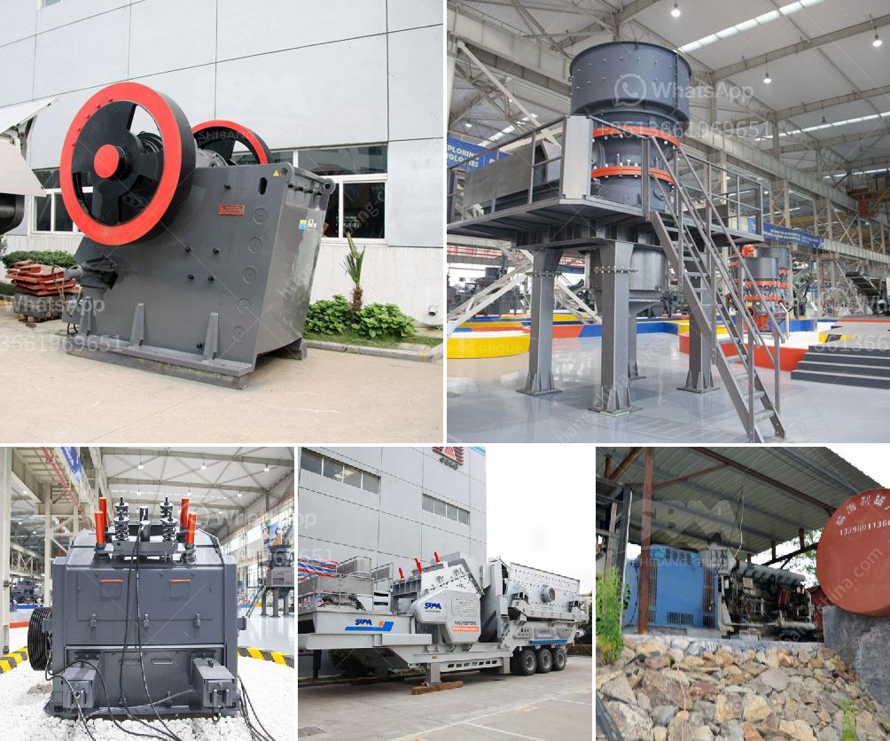

<h3>list used cement factory for sale in germany</h3>
Germany has long been known for its robust infrastructure and construction sector, making it a prime destination for cement manufacturing. However, in recent times, the industry has witnessed numerous transitions, prompting the availability of used cement factories for sale across the country. Today, we delve into the prospects and opportunities these factories present.

Located in the vibrant port city of Hamburg, this cement factory encompasses an extensive area equipped with advanced machinery and infrastructure. With a production capacity of up to 400,000 tonnes annually, the facility offers immense potential for expansion and growth. Additionally, it benefits from strategic proximity to major cities, facilitating efficient transportation and distribution.

Situated in the industrial heartland of Munster, this former cement plant boasts well-preserved structures and considerable land area. Primarily used for producing high-quality cement, the factory has the potential to cater to the demands of a local market while providing opportunities for expansion into neighboring regions. Its proximity to key logistics hubs enhances its market reach.

Nestled in the bustling capital city of Berlin, this chemical cement factory offers a unique advantage by incorporating an environmentally friendly production process. Utilizing sustainable technologies, the plant provides a distinct selling point for those seeking to tap into the growing demand for greener construction materials. Its location in a densely populated area augments its market potential significantly.

Boasting historical significance and architectural charm, this ancient cement factory in Munich presents an exciting opportunity for heritage redevelopment. Immersed in rich culture and surrounded by a thriving community, the factory's conversion into an event space, museum, or creative hub would undoubtedly attract local and international visitors while preserving its legacy.

As the construction industry continues to evolve, the availability of used cement factories for sale in Germany presents a promising prospect for investors seeking to capitalize on this sector's growth. Whether with enormous production capabilities, sustainable practices, or cultural heritage value, these factories provide opportunities for both domestic and international entrepreneurs ready to contribute to Germany's cement industry.
<h3>Contact us</h3><ul><li><strong>Whatsapp:&nbsp;<a href="https://wa.me/8613661969651">+8613661969651</a></strong></li><li><a href="https://swt.shibang-china.com/?git&amp;zhl&amp;list used cement factory for sale in germany"><strong>Online Service(chat now)</strong></a></li></ul><h3>Related</h3><ul><li><a href='roller mill for ares.md'>roller mill for ares</a></li><li><a href='cost of an industrial mill.md'>cost of an industrial mill</a></li><li><a href='rock crusher plant.md'>rock crusher plant</a></li><li><a href='products lm vertical grinding mills.md'>products lm vertical grinding mills</a></li><li><a href='450 tph limestone crusher.md'>450 tph limestone crusher</a></li></ul>