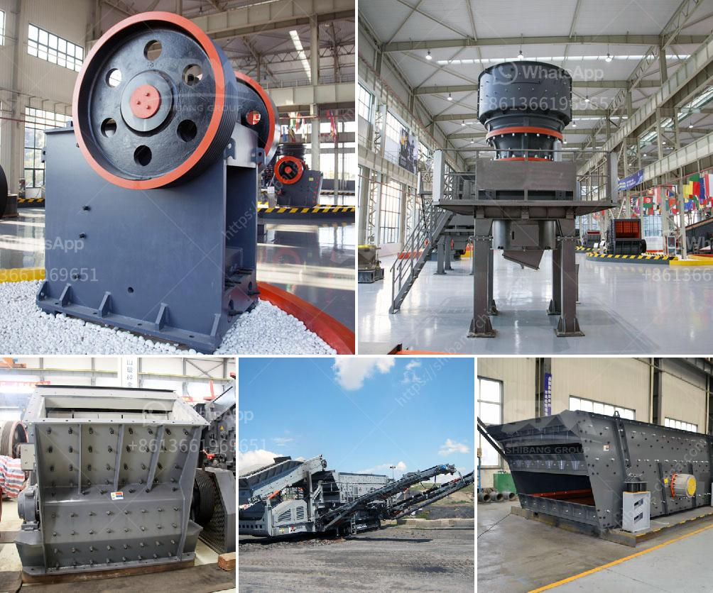

<h3>looking for washing plant for gold germany</h3>
Gold mining has been an important industry throughout history, and it continues to be a lucrative venture in many parts of the world. Germany, known for its extensive mineral resources, has a rich mining history and is currently home to many active gold mines. As a result, there is a growing demand for efficient and reliable washing plants to extract gold from the earth.

When it comes to searching for a washing plant for gold in Germany, there are various factors that prospective gold miners need to consider. The first aspect to evaluate is the size of the operation. Gold mining can range from small-scale artisanal mining to large commercial operations. Depending on the quantity of gold you aim to extract, your washing plant requirements will vary.

The next factor to consider is the location of the washing plant. Germany has diverse geological landscapes, and each region may present unique challenges along with its gold opportunities. Therefore, it is important to thoroughly research the geological conditions of specific areas and select a location that is known for its gold deposits. Additionally, being close to suitable water sources is crucial for efficient gold extraction through washing.

Another important aspect to look into is the types of washing plants available in Germany. There are various designs and sizes, each suited for different mining operations. Traditional methods include sluice boxes, rocker boxes, and gold pans. These manual methods have their advantages and disadvantages, and are usually adequate for small-scale mining. However, for larger-scale operations, mechanized washing plants are the preferred option. Trommels, jigs, and shaker tables are some of the commonly used industrial washing plants that provide high gold recovery rates.

Furthermore, it is important to consider the environmental impact of gold mining and choose a washing plant that ensures sustainable practices. Today, there is increasing pressure for companies to adopt eco-friendly technologies and minimize their carbon footprint. Fortunately, many washing plants incorporate innovative technologies that reduce water usage, energy consumption, and emissions. By choosing a plant with environmentally friendly features, miners can maximize their gold recovery while minimizing their impact on the natural surroundings.

Finally, before investing in a washing plant for gold in Germany, one must take into account the cost and availability of spare parts, maintenance, and technical support. Gold mining operations can be unpredictable, and equipment failures or breakdowns can occur. Therefore, it is vital to choose a supplier that offers reliable after-sales service, ensuring minimal downtime during critical mining activities.

In conclusion, Germany presents a wealth of gold mining opportunities, and finding the right washing plant is essential for successful gold extraction. By considering factors such as operation size, location, type of plant, environmental impact, and after-sales support, prospective gold miners can make an informed decision that maximizes their chances of success. With careful planning and the right equipment, Germany offers a promising and profitable future for the gold mining industry.
<h3>Contact us</h3><ul><li><strong>Whatsapp:&nbsp;<a href="https://wa.me/8613661969651">+8613661969651</a></strong></li><li><a href="https://swt.shibang-china.com/?git&amp;zhl&amp;looking for washing plant for gold germany"><strong>Online Service(chat now)</strong></a></li></ul><h3>Related</h3><ul><li><a href='impact crusher in egypt.md'>impact crusher in egypt</a></li><li><a href='crusher manufacturers in europe.md'>crusher manufacturers in europe</a></li><li><a href='kaolin clay mining crusher in malaysia.md'>kaolin clay mining crusher in malaysia</a></li><li><a href='used cement plant for sale in south africa.md'>used cement plant for sale in south africa</a></li><li><a href='bauxite crusher plant construction.md'>bauxite crusher plant construction</a></li></ul>