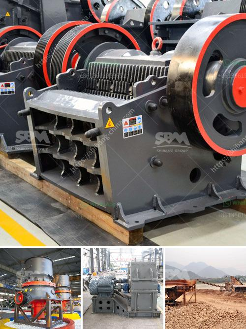

<h3>lum vertical mill</h3>
The Lum Vertical Mill is a revolutionary piece of equipment that has transformed the milling industry. With its advanced technology and innovation, it has set a new standard for efficiency and productivity in the field.

One of the standout features of the Lum Vertical Mill is its vertical structure. Unlike traditional horizontal mills, which can take up a significant amount of space, this mill is designed to be installed vertically, saving valuable floor space in the workshop. This compact design allows for better organization and utilization of space, promoting a more efficient workflow.

Another noteworthy feature of the Lum Vertical Mill is its high grinding efficiency. Equipped with a powerful motor and advanced grinding mechanisms, it can quickly and effectively grind various materials, including minerals, ores, and industrial raw materials. This impressive efficiency not only saves time but also reduces energy consumption, making it an environmentally friendly choice.

Durability and reliability are also key characteristics of the Lum Vertical Mill. Built with robust materials and a sturdy construction, it can withstand heavy usage and harsh working conditions without compromising its performance. This ensures a longer lifespan and minimal downtime, resulting in increased productivity and cost savings for businesses.

Furthermore, the Lum Vertical Mill offers user-friendly operation and maintenance. Its intuitive control system allows operators to easily adjust grinding parameters and monitor the milling process, while the automatic lubrication system ensures smooth and continuous operation. With low-maintenance requirements, operators can focus on other tasks in the workshop, enhancing overall operational efficiency.

In conclusion, the Lum Vertical Mill is a game-changer in the milling industry, thanks to its vertical structure, high grinding efficiency, durability, and user-friendly operation. Investing in this innovative mill will undoubtedly bring significant benefits to businesses, including increased productivity, space optimization, energy savings, and reduced maintenance costs.
<h3>Contact us</h3><ul><li><strong>Whatsapp:&nbsp;<a href="https://wa.me/8613661969651">+8613661969651</a></strong></li><li><a href="https://swt.shibang-china.com/?git&amp;zhl&amp;lum vertical mill"><strong>Online Service(chat now)</strong></a></li></ul><h3>Related</h3><ul><li><a href='barite mill saltillo.md'>barite mill saltillo</a></li><li><a href='philippines second hand stone crusher.md'>philippines second hand stone crusher</a></li><li><a href='febcoal coal mining plant in ethiopia.md'>febcoal coal mining plant in ethiopia</a></li><li><a href='crusher plant for coal.md'>crusher plant for coal</a></li><li><a href='cconveyor belts class.md'>cconveyor belts class</a></li></ul>