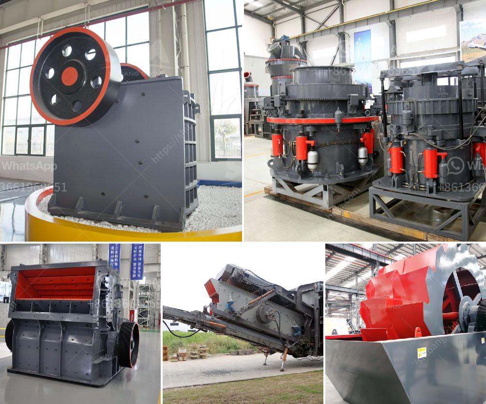

<h3>m sand manufacturing process</h3>
M sand, short for manufactured sand, is a type of fine aggregate that is specifically produced by crushing hard granite into particles of size and shape that are suitable for construction purposes. It is also known as crushed sand, artificial sand, and stone sand.

The process of manufacturing M sand involves several stages. First, the hard granite stones are crushed into aggregates of desired size using jaw crushers. The crushed stones are then passed through a vibrating screen to separate them based on size. Oversized stones are further crushed in a cone crusher or a vertical shaft impactor (VSI) machine to reduce their size to the desired level.

Once the desired size is achieved, the crushed aggregates are washed to remove any dust, impurities, or fines. The washing process ensures that the manufactured sand is clean and free from any contaminants that may affect its quality. It also improves the workability and durability of the sand.

Next, the washed aggregates are fed into a horizontal shaft impactor (HSI) or a vertical shaft impactor (VSI) machine. These machines use high-speed rotating rotors to crush the aggregates into smaller particles. This process helps in shaping the sand particles to have a consistent shape and size, similar to natural sand. It also ensures that the sand is not too coarse or too fine, making it suitable for various construction applications.

After the crushing and shaping process, the manufactured sand is sieved through different mesh sizes to classify it into different grades. The classified sand is then stored in stockpiles, ready to be used in construction projects. The different grades of M sand can be used for specific purposes, such as plastering, concrete production, road construction, and as a replacement for natural sand in masonry work.

The use of manufactured sand has gained popularity in recent years due to its numerous advantages over natural sand. Firstly, M sand is free from impurities, such as silt and clay, that are often found in river sand. This makes it ideal for use in concrete, where the presence of impurities can affect its strength and durability.

Secondly, the use of manufactured sand helps preserve natural resources, as it reduces the need for river sand extraction. The extraction of river sand can cause environmental damage, including erosion of riverbanks and depletion of groundwater resources. By using M sand, we can reduce our reliance on natural sand and minimize the ecological impact of construction activities.

Furthermore, M sand has consistent quality and properties, which makes it suitable for producing high-quality concrete. It has a higher compressive strength compared to natural sand, making it ideal for structural concrete applications. The uniform particle size distribution of M sand also improves the workability of concrete, resulting in better finish and reduced water demand.

In conclusion, the manufacturing process of M sand involves crushing hard granite into desired size, washing to remove impurities, crushing again to shape the particles, and sieving to classify into different grades. This process produces a high-quality and sustainable alternative to natural sand, which offers numerous benefits for construction projects. By opting for M sand, we can ensure the availability of a consistent and reliable supply of sand while minimizing the impact on the environment.
<h3>Contact us</h3><ul><li><strong>Whatsapp:&nbsp;<a href="https://wa.me/8613661969651">+8613661969651</a></strong></li><li><a href="https://swt.shibang-china.com/?git&amp;zhl&amp;m sand manufacturing process"><strong>Online Service(chat now)</strong></a></li></ul><h3>Related</h3><ul><li><a href='used stone crusher plant for sale in uk.md'>used stone crusher plant for sale in uk</a></li><li><a href='malaysia used conveyor belt for sale.md'>malaysia used conveyor belt for sale</a></li><li><a href='cost setting up silica sand ball mill.md'>cost setting up silica sand ball mill</a></li><li><a href='prices crusher prices gypsum crusher prices.md'>prices crusher prices gypsum crusher prices</a></li><li><a href='aggregate washing machine for sale.md'>aggregate washing machine for sale</a></li></ul>