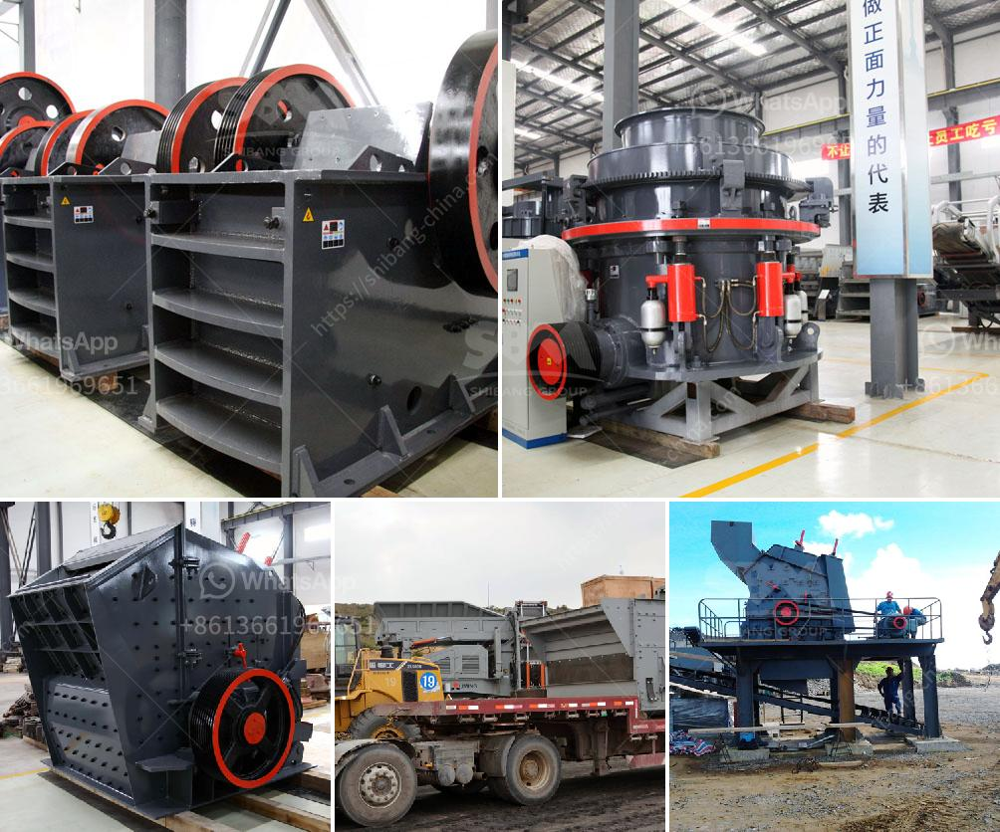

<h3>machine for crushing stones</h3>
A machine for crushing stones, commonly known as a stone crusher, is a machine designed to reduce large rocks into smaller rocks, gravel, sand, or rock dust. The earliest crushers were hand-held stones, where the weight of the stone provided a boost to muscle power, used against a stone anvil. Querns and mortars are types of these crushing devices.

In the modern era, the crusher has simplified the crushing process, enabling a more efficient operation. Moreover, it is environmentally friendly and energy-efficient, which means it reduces a significant amount of costs for the environment and for human health.

The machine works by utilizing high-speed rotating hammers that repeatedly crush the stones in the crushing chamber through the impact of high-speed collisions, greatly reducing the size of the stones. The crushed stones can then be used as raw materials for various construction activities such as building roads, bridges, or buildings.

The range of stone crushers manufactured by various companies enables us to choose the right one according to our specific requirements. They come in different sizes, depending on the capacity needed and the desired final product size. The flexibility of these machines allows them to be used in various fields such as mining, metallurgy, building materials, highways, railways, water conservancy, and chemical industries.

In addition to reducing the size of stones, these machines also have a screening mechanism that allows the separation of different sizes of crushed stones. This is done by passing the crushed stones through sieves or screens, ensuring that only the appropriate size of stones is used for further processes.

Overall, machines for crushing stones have revolutionized the construction industry and are highly beneficial for various applications. They not only save time and effort but also contribute to a more sustainable and eco-friendly approach in the field of construction. With their continuous development and improvement, it is safe to say that stone crushers will continue to play a significant role in the construction industry for years to come.
<h3>Contact us</h3><ul><li><strong>Whatsapp:&nbsp;<a href="https://wa.me/8613661969651">+8613661969651</a></strong></li><li><a href="https://swt.shibang-china.com/?git&amp;zhl&amp;machine for crushing stones"><strong>Online Service(chat now)</strong></a></li></ul><h3>Related</h3><ul><li><a href='best mills for barite.md'>best mills for barite</a></li><li><a href='start m sand unit kerala cost.md'>start m sand unit kerala cost</a></li><li><a href='crusher on rent in india.md'>crusher on rent in india</a></li><li><a href='jaw crusher diagram.md'>jaw crusher diagram</a></li><li><a href='1 tonne roller mill.md'>1 tonne roller mill</a></li></ul>