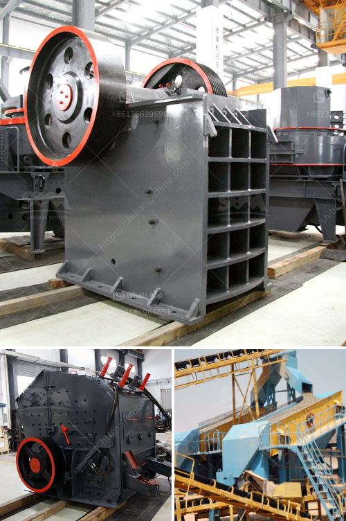

<h3>machine grinds talcum powder</h3>
Machine grinding has long been an essential process in various industries, enabling the production of finely ground powders that serve diverse applications. One such example is the talcum powder industry, where the need for precision and efficiency in grinding is paramount. This article explores the significance of machine grinding in talcum powder production, highlighting its ability to achieve optimal particle size, enhance product quality, and meet consumer demands.

Machine grinding is the mechanical process of reducing a material into fine particles using technology-driven equipment. In talcum powder production, machine grinding plays a crucial role in achieving the finely ground powder desired for cosmetic, pharmaceutical, and other applications. Traditional hand grinding methods cannot match the level of accuracy and consistency achieved through machine grinding.

One of the key advantages of machine grinding in talcum powder production is the ability to achieve a precise and consistent particle size. Machines are designed with specially calibrated settings to produce powders within a specific size range, ensuring that the desired physical and chemical properties of talcum powder are maintained. This precision enables manufacturers to meet stringent quality requirements and produce consistently reliable products.

Machine grinding also significantly enhances the efficiency of talcum powder production. Traditional grinding methods require a considerable amount of time and effort, leading to slower production rates. On the other hand, machines are capable of handling large volumes of talc, grinding it quickly and efficiently. This results in increased productivity, reduced labor costs, and overall improved production flow in manufacturing facilities.

Machine grinding offers the benefits of quality control and consistency that are critical for talcum powder production. Manufacturers can monitor and adjust grinding parameters, ensuring that the resulting powder meets the required specifications. By maintaining a consistent particle size, color, and texture, machine grinding enables the reproducibility of talcum powder batches, avoiding variations and ensuring customer satisfaction.

With the advancements in machine grinding technology, talcum powder manufacturers can cater to diverse consumer demands. Different applications, such as cosmetics, personal care products, and pharmaceuticals, require specific particle sizes and other quality attributes. Machine grinding allows for customization, enabling manufacturers to produce talcum powder that precisely matches the needs of their target markets.

In conclusion, machine grinding plays a pivotal role in talcum powder production. Its ability to achieve precision and consistent particle size ensures the desired quality standards are met. Moreover, machine grinding enhances production efficiency, reduces labor costs, and enables manufacturers to cater to diverse consumer demands. As the talcum powder industry continues to evolve, machine grinding will remain an essential process, allowing manufacturers to produce superior quality products efficiently.
<h3>Contact us</h3><ul><li><strong>Whatsapp:&nbsp;<a href="https://wa.me/8613661969651">+8613661969651</a></strong></li><li><a href="https://swt.shibang-china.com/?git&amp;zhl&amp;machine grinds talcum powder"><strong>Online Service(chat now)</strong></a></li></ul><h3>Related</h3><ul><li><a href='mill clay grinding in delhi.md'>mill clay grinding in delhi</a></li><li><a href='used rotary kiln equipment for sale.md'>used rotary kiln equipment for sale</a></li><li><a href='mobile stone crushing plant.md'>mobile stone crushing plant</a></li><li><a href='crushing plants for sale.md'>crushing plants for sale</a></li><li><a href='sample of granite quarry proposal.md'>sample of granite quarry proposal</a></li></ul>