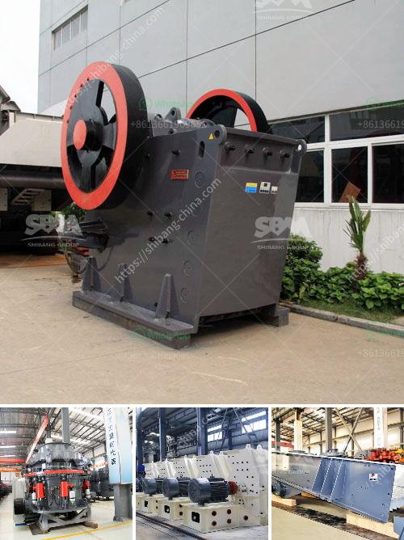

<h3>machine that to crush rock</h3>
Crushing rocks at the construction site or in the mining quarry has always been a tedious task due to the difficulty of accessing large rocks and the amount of labor required. However, with the advent of modern technology, a revolutionary machine has been developed to simplify and accelerate the rock crushing process. This machine, aptly named the rock crusher, offers a practical solution for job sites requiring crushed rocks for various applications such as road construction, landscaping, or even personal use.

The rock crusher operates on a simple principle that applies mechanical force to break rocks into smaller pieces. The machine consists of a robust metal drum that spins rapidly, while a set of hammers repeatedly strike the rocks until they are pulverized into smaller fragments. This process prevents any unnecessary strain on the user, as manually crushing rocks can be physically demanding and time-consuming.

One of the key advantages of this rock crushing machine is its versatility. It can handle a wide range of rock types, including granite, limestone, sandstone, and more. This aspect makes the rock crusher a valuable asset in various industries, from construction to mining. Moreover, the machine is designed with portability in mind, making it easy to transport from one job site to another efficiently.

Safety is prioritized in the design of the rock crushing machine. The drum is enclosed, ensuring that flying debris or dust particles are prevented from escaping during the crushing process. Additionally, the rock crusher minimizes vibrations, reducing risks of accidents or structural damage. From an environmental standpoint, this machine also helps minimize waste and preserve natural resources by crushing rocks into reusable products.

The rock crusher marks a significant advancement in the construction and mining industries, as it revolutionizes the traditional manual rock crushing methods. With its operational efficiency, versatility, and focus on safety, this machine ensures the streamlined crushing of rocks for a wide range of applications. Whether it is a large-scale construction project or a small personal endeavor, the rock crusher offers a convenient and efficient solution for crushing rocks effortlessly.
<h3>Contact us</h3><ul><li><strong>Whatsapp:&nbsp;<a href="https://wa.me/8613661969651">+8613661969651</a></strong></li><li><a href="https://swt.shibang-china.com/?git&amp;zhl&amp;machine that to crush rock"><strong>Online Service(chat now)</strong></a></li></ul><h3>Related</h3><ul><li><a href='stone crushing plant use jaw crusher price list.md'>stone crushing plant use jaw crusher price list</a></li><li><a href='price of quarry crusher in zambia.md'>price of quarry crusher in zambia</a></li><li><a href='second hand stone crusher sale in india.md'>second hand stone crusher sale in india</a></li><li><a href='cone crusher sri lanka for sale.md'>cone crusher sri lanka for sale</a></li><li><a href='best mill for wet grinding of calcium carbonate.md'>best mill for wet grinding of calcium carbonate</a></li></ul>