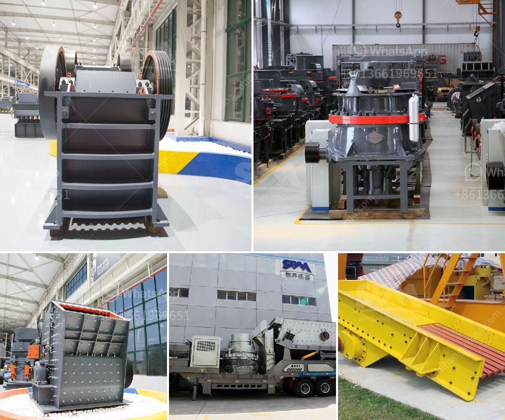

<h3>machinery crushing machine</h3>
In today's industrial era, machinery plays a crucial role in simplifying complex tasks and increasing productivity. One such machine is the crushing machine, designed to break down large aggregates or minerals into smaller, more manageable sizes. Used extensively in construction and mining industries, crushing machines offer an effective solution to reduce materials for further processing or disposal.

As the name suggests, a crushing machine applies force to break materials apart. It comes in various forms, including jaw crushers, cone crushers, impact crushers, and gyratory crushers, each designed to cater to different industrial needs. These machines have robust structures and powerful motors, capable of breaking down the toughest materials, such as rocks, ores, and concrete.

The primary purpose of a crushing machine is to transform large and irregularly shaped materials into smaller, uniform particles suitable for subsequent processing. By reducing the size of the raw materials, crushing machines enable more efficient transportation, storage, and utilization of resources, saving both time and money.

In the construction industry, crushing machines are instrumental in creating strong foundations for buildings and structures. They are used to crush stones, gravel, and concrete, allowing the creation of aggregates necessary for the production of concrete, asphalt, and other construction materials. Similarly, mining industries rely on crushing machines to extract valuable minerals trapped within rocks and ores.

Moreover, modern crushing machines are equipped with advanced features to increase efficiency and versatility. Some machines have adjustable settings, allowing operators to control the size and shape of the final product. Others, like impact crushers, can be used to produce multiple products simultaneously by adjusting the rotor speed or changing the configuration of the crushing chamber.

Safety is of utmost importance in any industrial environment, and the manufacturers of crushing machines recognize this. Today's crushing machines are designed with safety features such as emergency stop buttons, interlocks, and protective guards, ensuring the well-being of operators and preventing accidents.

In conclusion, machinery crushing machines are indispensable tools for various industrial and construction projects. They reduce the size of materials, making them easier to handle, transport, and process. With their robust structures, powerful motors, and advanced features, these machines offer an efficient and safe solution for breaking down rocks, ores, concrete, and other materials. Their ability to transform raw materials into smaller particles paves the way for further processing and contributes to the development of numerous industries, ultimately driving economic growth.
<h3>Contact us</h3><ul><li><strong>Whatsapp:&nbsp;<a href="https://wa.me/8613661969651">+8613661969651</a></strong></li><li><a href="https://swt.shibang-china.com/?git&amp;zhl&amp;machinery crushing machine"><strong>Online Service(chat now)</strong></a></li></ul><h3>Related</h3><ul><li><a href='rent stone crusher in gresik.md'>rent stone crusher in gresik</a></li><li><a href='price list of washing of rock phosphate.md'>price list of washing of rock phosphate</a></li><li><a href='top stone crusher companies in india.md'>top stone crusher companies in india</a></li><li><a href='dolomite production plant.md'>dolomite production plant</a></li><li><a href='grinding mill for limestone italy.md'>grinding mill for limestone italy</a></li></ul>