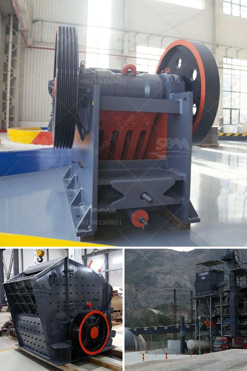

<h3>machinery from italy for gypsum powder production</h3>
Italy is renowned for its craftsmanship and engineering excellence in various industries. One such industry where Italy stands out is the production of machinery for gypsum powder. Gypsum powder is widely used in construction, agriculture, and other industries due to its versatile nature and excellent binding properties. Italian machinery manufacturers have gained a strong reputation for delivering high-quality and reliable equipment for gypsum powder production.

Italian machinery for gypsum powder production incorporates advanced technology and innovation, ensuring efficient and cost-effective manufacturing processes. The equipment is designed to handle the entire production cycle, from raw material sourcing to final packaging. These machines not only streamline the production process but also improve product quality and consistency.

The first step in gypsum powder production is raw material preparation. Italian machinery manufacturers offer technologically advanced equipment for crushing, grinding, and calcining gypsum rock or synthetic gypsum. This process ensures that the gypsum is finely ground and thermally treated to obtain the desired consistency and properties for further processing.

Once the raw material is prepared, it is then mixed with additives and water to form a slurry. Italian machinery for gypsum powder production includes state-of-the-art mixers that ensure thorough and homogeneous mixing of the slurry. These mixers are designed to optimize the distribution of additives, resulting in a high-quality gypsum powder with excellent properties.

The next crucial step in the production process is the drying of the gypsum slurry. Italian manufacturers offer a range of drying technologies, including rotary dryers and fluidized bed dryers. These drying systems are designed for high efficiency and energy-saving operations. They ensure that the gypsum slurry is dried to the required moisture content, yielding a powder with optimal quality and consistency.

Italian machinery for gypsum powder production also includes advanced equipment for powder classification. This process separates the gypsum powder into different particle sizes, ensuring that each fraction meets specific application requirements. These classifiers employ innovative technologies such as high-speed rotating screens and air classifiers to achieve precise classification and high-quality powder.

The final step in the process is the packaging of the gypsum powder. Italian manufacturers provide automatic packaging machines that can pack the powder into various types of bags or containers, depending on customer preferences. These machines ensure accurate and efficient packaging, minimizing manual labor and increasing productivity.

Italian machinery for gypsum powder production not only offers cutting-edge technology but also ensures compliance with international quality and safety standards. Italian manufacturers prioritize customer satisfaction and provide comprehensive after-sales support, including spare parts availability and technical assistance.

Italy's leading role in gypsum powder machinery production is a testament to its commitment to excellence and continuous innovation. Customers worldwide can rely on Italian machinery to deliver reliable, efficient, and high-quality equipment for gypsum powder production. By investing in Italian machinery, manufacturers can maximize their production capabilities and offer superior gypsum powder products to their customers.
<h3>Contact us</h3><ul><li><strong>Whatsapp:&nbsp;<a href="https://wa.me/8613661969651">+8613661969651</a></strong></li><li><a href="https://swt.shibang-china.com/?git&amp;zhl&amp;machinery from italy for gypsum powder production"><strong>Online Service(chat now)</strong></a></li></ul><h3>Related</h3><ul><li><a href='stone crusher price tons per hour.md'>stone crusher price tons per hour</a></li><li><a href='gypsum machinery plant from france.md'>gypsum machinery plant from france</a></li><li><a href='fine powder grinders machine.md'>fine powder grinders machine</a></li><li><a href='crusher and screening plants for sale.md'>crusher and screening plants for sale</a></li><li><a href='hard rock crusher.md'>hard rock crusher</a></li></ul>