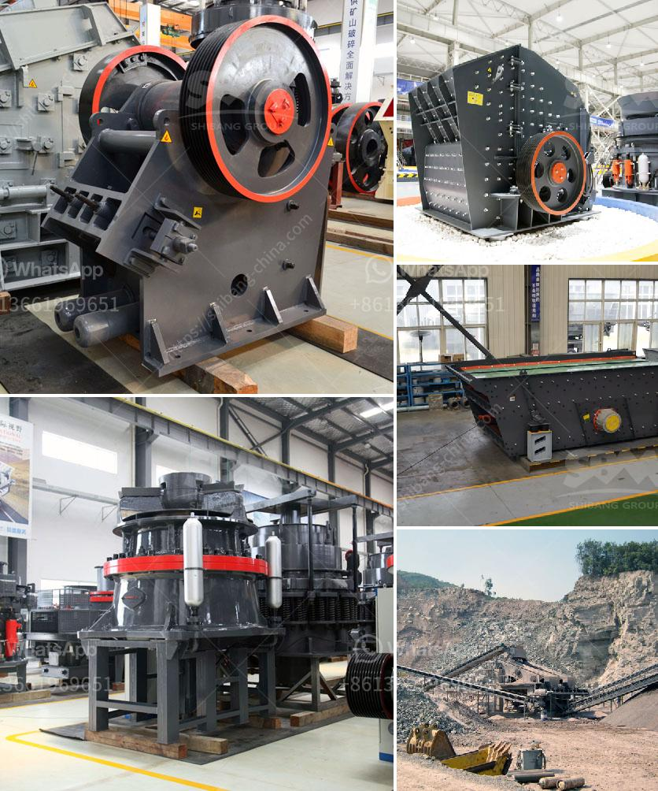

<h3>machinery in limestone production</h3>
Limestone is a versatile sedimentary rock that has been used for centuries in various industries. It is the raw material for the manufacture of quicklime (calcium oxide), slaked lime (calcium hydroxide), cement, and mortar. Pulverized limestone is used as a soil conditioner to neutralize acidic soils and enhance crop yields. Additionally, limestone is used for the production of glass, steel, and even toothpaste.

To efficiently extract limestone from the ground, specialized machinery is needed. This heavy equipment includes crushers, conveyors, and drills that are used to remove the limestone from the quarry. Apart from these machines, water sprinklers, dust suppression systems, and bulldozers may also be employed to reduce environmental pollution and improve mining efficiency.

In the limestone production process, different machinery and equipment are required for various stages. These include primary and secondary crushers, screens, conveyors, and mills. From the quarry to the kiln, countless tasks need to be completed efficiently to produce high-quality limestone products. The utilization of modern machinery not only enhances productivity but also ensures the safety of workers.

One common machine used in this process is the crusher. Many limestone crushing plants include multiple stages of crushing to ensure maximum efficiency. This often includes a primary crusher that can handle raw limestone with a size of up to 1500mm. Additionally, a secondary crusher, such as a cone or impact crusher, is often used in subsequent stages to further reduce the limestone particle size. Screens are then used to separate the crushed limestone into different sizes before it is conveyed to storage or milling facilities.

The use of machinery in limestone production greatly enhances efficiency and output. With the help of these machines, the extraction process becomes faster, safer, and more environment-friendly. The various stages involved in limestone production can be completed with a higher level of accuracy, resulting in a final product that meets the required specifications.

In conclusion, machinery and equipment play a crucial role in limestone production. These machines not only facilitate the extraction process but also ensure the quality and quantity of limestone produced. With the help of modern technology, the mining and production of limestone have become more efficient, sustainable, and cost-effective.
<h3>Contact us</h3><ul><li><strong>Whatsapp:&nbsp;<a href="https://wa.me/8613661969651">+8613661969651</a></strong></li><li><a href="https://swt.shibang-china.com/?git&amp;zhl&amp;machinery in limestone production"><strong>Online Service(chat now)</strong></a></li></ul><h3>Related</h3><ul><li><a href='grinding crushing mill brick.md'>grinding crushing mill brick</a></li><li><a href='micro powder grinding mill prices.md'>micro powder grinding mill prices</a></li><li><a href='conveyor belt manufacturers in kolkata.md'>conveyor belt manufacturers in kolkata</a></li><li><a href='portable cone crusher plant.md'>portable cone crusher plant</a></li><li><a href='roll mill machine.md'>roll mill machine</a></li></ul>