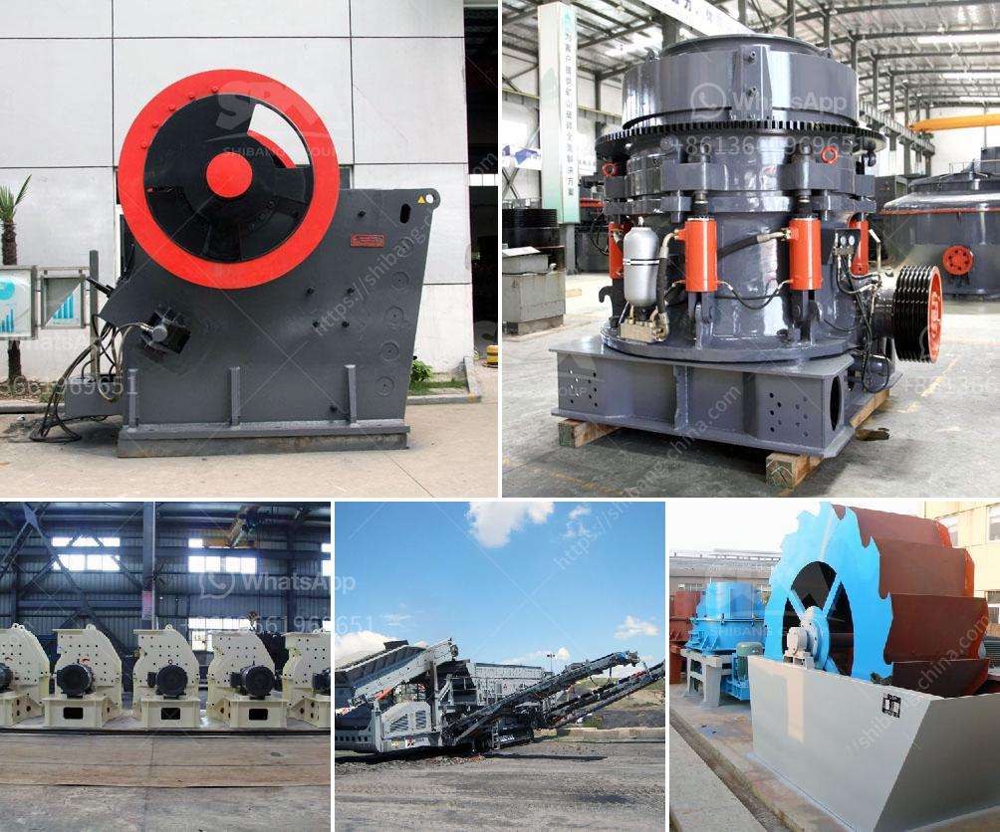

<h3>machines used stone crusher vancouver</h3>
Stone crushing is an important process in various industries. Some stones are used for road construction, building foundations, drainage systems, and landscaping enhancements. Crushers are indispensable machines in the mining and quarrying industry. Different types of stone crushers have different models, names, and functions. Sometimes they are named according to materials such as rock crushers, ore crushers, quarry crushers, granite crushers, concrete crushers, etc. Among those, jaw crusher is the most common, which can be divided into fixed jaw crushers and mobile jaw crushers depending on the way of installation.

Fixed jaw crushers are widely used in primary crushing applications. They are mainly used in processing concrete, cement, mining, and construction industries. The stone crusher machines produce high quality materials for highway, railway, airport, runway and building construction.

Some of the popular models of fixed jaw crushers are PE80×1500, PE1200×1500, PE1500×1800, etc. They are designed to handle primary crushing applications and are capable of breaking large stones into specific sizes. If you have a quarry, one of these machines might be right for you.

The mobile jaw crusher is equipped with main machine with large crushing ratio, which can be used for primary crushing of mineral materials. Of course, it is also a good helper in waste recycling, so that waste mortar, bricks and stones can be reprocessed to make recycled aggregates for new building materials.

The mobile jaw crusher can be divided into tracked mobile jaw crusher and wheeled mobile jaw crusher. The equipment set feeding, crushing, conveying as one of the equipment. During the operation, it can not only achieve direct crushing processing of materials on the site, but also with a lower input, harvest higher benefits, so quite favored by processing plants.

Materials: The quantity of the materials that need to be crushed and processed plays a vital role in stone crusher machine efficiency. Materials that can be processed are not only hard but also brittle and soft.

Transporting Conditions: The transportation conditions affect the efficiency of stone crusher machines. For instance, the distance between the crushing site and the machines greatly affect the efficiency of the crushing machines.

Availability of Auxiliary Machines: Like jaw crusher machines, impact crusher machines, cone crusher machines, etc. and their spare parts should be with strong backup.

Energy Consumption: Energy consumption is also a factor affecting the efficiency of stone crusher machine. For example, high-energy consumption of jaw crushers will consume more energy and at the same time will seriously affect the production capacity of the crusher.

Self-generated Wind Pressure System Dust Removal: The stone crusher machine relies on dodge and blake to destroy the rock. With the process of destroying the toggle plate, which consists of windows and wedges, it’s moved to the top so that it can be destroyed.

Stone crusher machines are the machines that are used to crush the stones to smaller rocks or to powder form after extraction of minerals from the mines. These stones are crushed using crushers, which are divided into several categories according to their specifications. The selection process of these crushers determines the efficiency of the stone crusher machine.
<h3>Contact us</h3><ul><li><strong>Whatsapp:&nbsp;<a href="https://wa.me/8613661969651">+8613661969651</a></strong></li><li><a href="https://swt.shibang-china.com/?git&amp;zhl&amp;machines used stone crusher vancouver"><strong>Online Service(chat now)</strong></a></li></ul><h3>Related</h3><ul><li><a href='cone crusher for sale philippines.md'>cone crusher for sale philippines</a></li><li><a href='slag quarry equipments supplies in algeria.md'>slag quarry equipments supplies in algeria</a></li><li><a href='used mobile jaw crushers for sale in uk.md'>used mobile jaw crushers for sale in uk</a></li><li><a href='price crusher mill price stone crusher.md'>price crusher mill price stone crusher</a></li><li><a href='gold mining equipment nevada oregon used rock crushers.md'>gold mining equipment nevada oregon used rock crushers</a></li></ul>